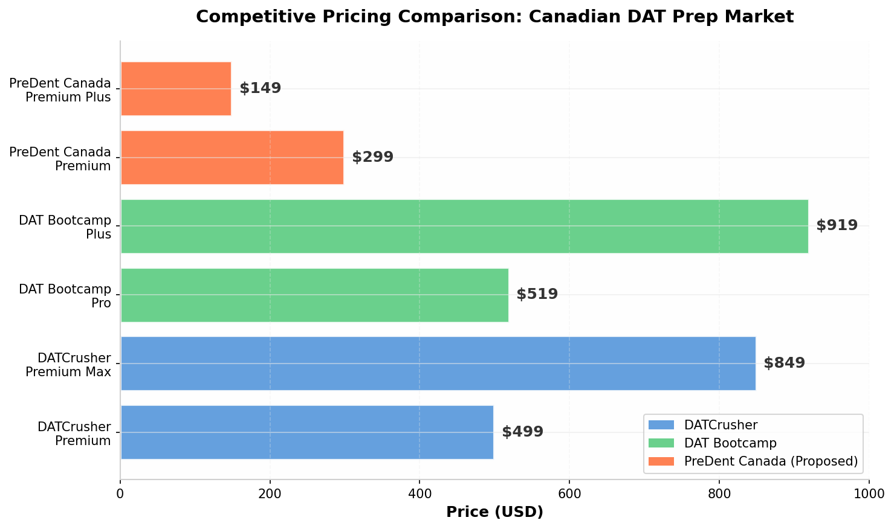
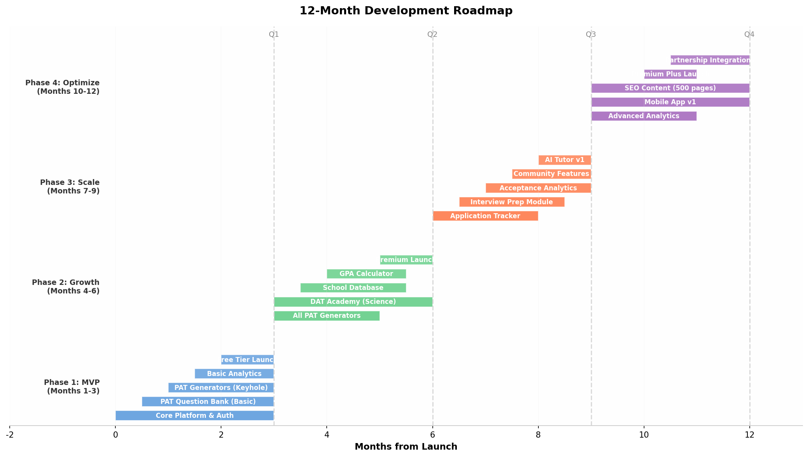
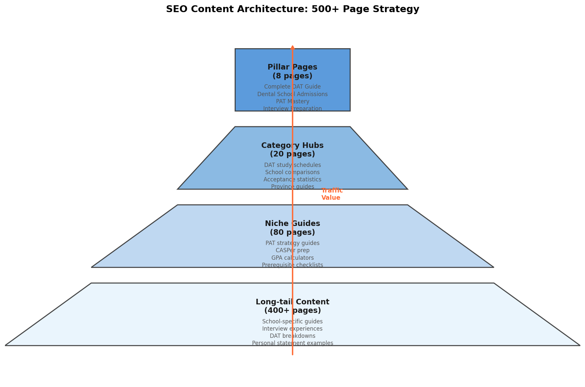
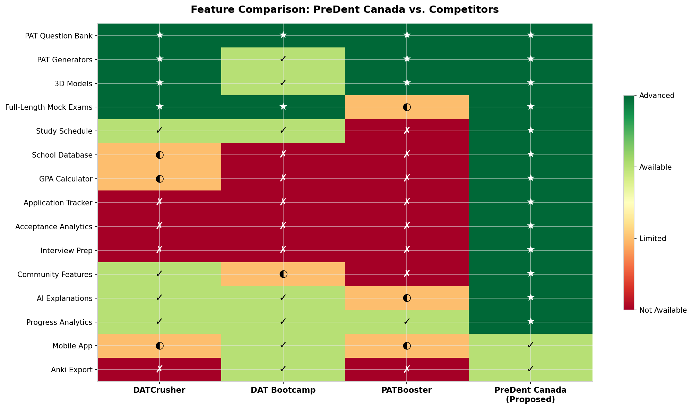
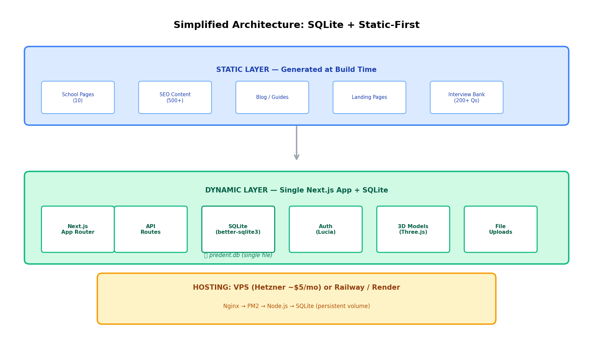
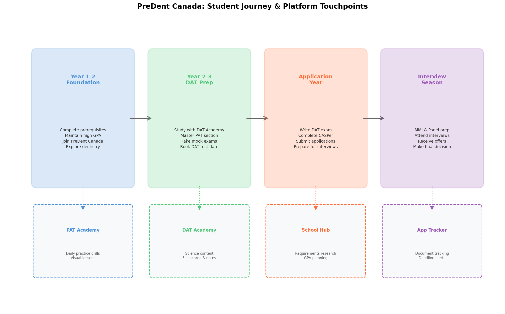

# PreDent Canada: Complete Product Requirements Document

## "The Operating System for Canadian Pre-Dental Students"

---

## Executive Summary

PreDent Canada is a comprehensive platform designed to serve as the single destination for Canadian pre-dental students throughout their entire journey — from freshman year exploration to dental school acceptance. Unlike existing competitors that focus narrowly on DAT question banks, PreDent Canada integrates **PAT mastery, DAT preparation, dental school admissions intelligence, application tracking, GPA calculators, interview preparation, and community-driven insights** into one cohesive ecosystem. This integration creates a powerful network effect: students who join for PAT practice stay for admissions guidance, and those who discover the platform through school research eventually convert to paid DAT prep users.

The Canadian dental education landscape presents a unique market opportunity. There are only **10 Canadian dental schools**, yet they receive thousands of applications annually — the University of Toronto alone processes **over 900 applications for just 96 seats**[^13^]. The Dental Aptitude Test (DAT) is administered by the Canadian Dental Association (CDA) and scored on a 1–30 scale, with competitive applicants typically scoring **21+ on the Academic Average and 20+ on the PAT**[^12^]. The current market is dominated by DATCrusher (the Canadian-specific leader) and DAT Bootcamp (the US-focused giant), but neither platform addresses the full admissions lifecycle. DATCrusher excels at Canadian-specific DAT content but lacks admissions tools, school databases, and application planning features. DAT Bootcamp offers superior video content but is optimized for the American DAT format, which differs significantly from the Canadian version in structure, content, and scoring[^1^][^9^].

PreDent Canada's product strategy centers on six core pillars: **PAT Academy** (the flagship differentiator with unlimited PAT generators and 3D visualizations), **DAT Academy** (science content with flashcards, cheat sheets, and study schedules), **Dental School Hub** (comprehensive database of all 10 Canadian schools with requirement comparisons), **Application Planner** (timeline tracking and document management), **Community Intelligence** (aggregated Reddit insights, admission news, and DAT breakdowns), and **Acceptance Analytics** (probability engine and competitive benchmarking). The platform operates on a freemium model: a robust free tier drives acquisition through school database access, basic lessons, and GPA calculators, while Premium (Monthly $39, 3-Month $99, Annual $249 CAD) unlocks PAT generators, full mock exams, advanced analytics, and practice content.

The financial opportunity is substantial. DATCrusher, the current Canadian market leader, charges **$499 USD for 90-day premium access and $849 USD for 180-day premium max**[^34^], yet serves only the DAT prep use case. By expanding the addressable market to include students in their first and second years of undergraduate study — who need school research and GPA planning tools but aren't yet ready for DAT prep — PreDent Canada can capture users 2–3 years earlier in their journey and retain them through the entire application cycle. The SEO strategy targets **500+ content pages** addressing high-intent searches like "What GPA for UBC dentistry?" and "Does Western require CASPer?" — queries that existing competitors do not adequately answer. These pages compound organic traffic every admission cycle, creating a sustainable acquisition engine that reduces dependence on paid advertising.

---

## Table of Contents

1. [Product Vision & Positioning](#1-product-vision--positioning)
2. [Pillar 1: PAT Academy](#2-pillar-1-pat-academy)
3. [Pillar 2: DAT Academy](#3-pillar-2-dat-academy)
4. [Pillar 3: Dental School Hub](#4-pillar-3-dental-school-hub)
5. [Pillar 4: Application Planner](#5-pillar-4-application-planner)
6. [Pillar 5: Community Intelligence](#6-pillar-5-community-intelligence)
7. [Pillar 6: Membership & Monetization](#7-pillar-6-membership--monetization)
8. [Killer Features & Differentiators](#8-killer-features--differentiators)
9. [Database Schema](#9-database-schema)
10. [User Flows](#10-user-flows)
11. [Wireframes](#11-wireframes)
12. [Feature Roadmap](#12-feature-roadmap)
13. [SEO Architecture](#13-seo-architecture)
14. [Visual Design System](#14-visual-design-system)
15. [Competitive Analysis](#15-competitive-analysis)
16. [Technical Architecture](#16-technical-architecture)
17. [Go-to-Market Strategy](#17-go-to-market-strategy)

---

## 1. Product Vision & Positioning

### 1.1 Mission Statement

PreDent Canada exists to democratize access to dental school admissions intelligence and eliminate information asymmetry for Canadian pre-dental students. Every aspiring dentist deserves transparent data about school requirements, a personalized roadmap for preparation, and affordable access to high-quality PAT training tools — not fragmented information scattered across Reddit threads, outdated wikis, and expensive prep courses.

### 1.2 Market Context

The Canadian dental school admissions landscape is extraordinarily competitive. With only **10 dental schools** across the entire country and approximately **600 total first-year seats** available annually, the acceptance rate hovers between **10–15%** at most institutions. The University of Toronto receives over **900 applications for 96 seats**[^13^], while Western University's Schulich School of Dentistry reported an entering class of 56 students with an average two-year GPA of **89.85%** and DAT averages of **21 RC / 21 PAT**[^21^]. McGill University's Faculty of Dental Medicine admitted students with an average IP GPA of **3.83** and OOP GPA of **3.92**[^12^]. These statistics reveal a market of highly motivated, academically strong students willing to invest significant resources in their preparation — yet the tools available to them remain fragmented and incomplete.

| Metric                             | Value                      | Source                     |
| ---------------------------------- | -------------------------- | -------------------------- |
| Canadian Dental Schools            | 10                         | [^12^]                     |
| Total Annual First-Year Seats      | ~600                       | Estimated from school data |
| UofT Applications per Seat         | ~9.4 (900 apps / 96 seats) | [^13^]                     |
| Average Admitted GPA (UofT)        | 3.96                       | [^13^]                     |
| Average DAT AA (UofT)              | 24                         | [^13^]                     |
| Average DAT PAT (UofT)             | 23                         | [^13^]                     |
| Western Average GPA (Best 2 Years) | 89.85%                     | [^21^]                     |
| UBC Average Admitted GPA           | 86.24%                     | [^12^]                     |
| Saskatchewan Resident Mean DAT     | 21.88 (2026)               | [^7^]                      |

### 1.3 Competitive Landscape

The Canadian DAT prep market is currently a duopoly with significant gaps. DATCrusher (by Booster Prep) has established itself as the **#1 Canadian DAT study tool**, used by what the company claims is **90% of Canadian test-takers**[^34^]. Their premium membership at $499 USD for 90 days includes **6,700+ questions, 2,000+ videos, PATBooster integration, and PAT generators**[^34^]. However, their platform is narrowly focused on test content — there is no school database, no application planning tools, no interview preparation, and no community features beyond a study group. DAT Bootcamp, the dominant US player, charges **$519 USD for their Pro package** and offers superior video lesson quality and written explanations, but their content is optimized for the American DAT which includes sections (Organic Chemistry, Quantitative Reasoning) not found on the Canadian exam[^9^]. Students preparing for the Canadian DAT who use Bootcamp waste time on irrelevant content and miss Canadian-specific topics.

The gaps in the current market create a clear opportunity for PreDent Canada:

| Gap                           | Current State                                 | PreDent Canada Solution                                        |
| ----------------------------- | --------------------------------------------- | -------------------------------------------------------------- |
| School requirement research   | Students manually check 10 different websites | Unified database with side-by-side comparisons                 |
| Application timeline tracking | Spreadsheets or Notion templates              | Built-in planner with deadline alerts                          |
| Interview preparation         | Expensive consulting ($500–$2,000)            | Integrated MMI/Panel prep with question bank                   |
| Acceptance probability        | Guesswork based on Reddit anecdotes           | Data-driven calculator with school-specific models             |
| PAT practice limitations      | Fixed question banks run out                  | Unlimited generators for keyhole, cube counting, hole punching |
| Community intelligence        | Scattered Reddit threads                      | Curated, searchable database of experiences                    |
| GPA planning                  | Manual calculation, unclear policies          | Automated calculators with school-specific formulas            |



### 1.4 User Personas

**Primary Persona: "The Determined Applicant" (Sarah, 22)**

Sarah is in her third year of a Biology major at McGill University with a current GPA of 3.78. She discovered dentistry in her second year through shadowing a family friend and has since accumulated 80 hours of shadowing experience. She plans to write the Canadian DAT in May of her third year and apply broadly to McGill, UofT, Western, and UBC. Sarah is highly organized and already maintains a spreadsheet tracking her prerequisites, but she struggles to find reliable information about each school's weighting formulas and interview formats. She discovers PreDent Canada through a Google search for "McGill dentistry requirements" and initially uses the free school database and GPA calculator. After seeing the value, she upgrades to Premium three months before her DAT to access the PAT generators and full-length mock exams. Sarah represents the **core revenue-driving persona** — she converts to paid after experiencing the free tier's value and stays engaged through the application season.

**Secondary Persona: "The Early Explorer" (James, 19)**

James just finished his first year at the University of Alberta with a 3.65 GPA. He's considering dentistry but isn't fully committed yet — he's also exploring medicine and pharmacy. James joins PreDent Canada's free tier to explore the "What is Dentistry?" content, use the GPA calculator to understand how his grades stack up, and browse the school database to understand what prerequisites he needs to complete in years 2 and 3. He doesn't convert to paid immediately, but he returns to the platform monthly to check his progress and read community content. Eighteen months later, when he's ready to start DAT prep, James upgrades to Premium because he's already familiar with the platform and trusts the brand. James represents the **long-term acquisition play** — capturing users early builds brand loyalty and creates a conversion pipeline.

**Tertiary Persona: "The Reapplicant" (Priya, 24)**

Priya applied to five Canadian dental schools last cycle and was waitlisted at two but didn't receive an offer. She has a strong GPA (3.88) but her DAT scores were below average (AA 19, PAT 18). She knows she needs to improve her PAT score significantly before retaking. Priya upgrades to the Annual plan to cover her retake and the next application cycle, using the acceptance analytics to understand which schools she was most competitive at and where to focus her efforts. Priya represents the **high-intent, high-value user** who is willing to pay for comprehensive support and is the primary upgrade-path target.

---

## 2. Pillar 1: PAT Academy

The Perceptual Ability Test (PAT) is the **flagship differentiator** for PreDent Canada and the primary driver of premium conversions. The PAT section of the Canadian DAT consists of **90 questions divided into 6 subsections of 15 questions each**, administered over **60 minutes** — meaning students have approximately **40 seconds per question**[^16^][^52^]. This intense time pressure makes the PAT one of the most challenging sections for Canadian test-takers, and it is also the section where software-based preparation provides the greatest advantage over traditional study methods. The six PAT question types are[^3^][^10^]:

| #   | Question Type       | Official Name        | Description                                   | Time per Q | Difficulty |
| --- | ------------------- | -------------------- | --------------------------------------------- | ---------- | ---------- |
| 1   | **Keyholes**        | Apertures            | Match 3D object to correct aperture           | ~30 sec    | Medium     |
| 2   | **Top-Front-End**   | View Recognition     | Identify missing orthographic projection      | ~45 sec    | Hard       |
| 3   | **Angle Ranking**   | Angle Discrimination | Rank 4 angles from smallest to largest        | ~25 sec    | Medium     |
| 4   | **Hole Punching**   | Paper Folding        | Determine hole pattern after folding/punching | ~40 sec    | Hard       |
| 5   | **Cube Counting**   | Cube Counting        | Count painted faces on stacked cubes          | ~35 sec    | Medium     |
| 6   | **Pattern Folding** | 3D Form Development  | Identify correct 3D form from 2D pattern      | ~50 sec    | Very Hard  |

The Canadian DAT PAT is administered digitally at Prometric testing centers since 2022[^16^], making online practice essential. Students who only practice with paper-based resources are at a significant disadvantage on test day. PreDent Canada's PAT Academy addresses this need through four integrated components: a comprehensive question bank, unlimited PAT generators, visual lessons with guided walkthroughs, and an AI-powered explanation engine.

### 2.1 PAT Question Bank

The question bank serves as the foundation of PAT preparation, offering **thousands of questions across all six categories** with four difficulty levels: Beginner, Intermediate, Advanced, and Elite. Each question is tagged with multiple metadata dimensions to enable precise filtering and adaptive learning.

**Question Metadata Schema:**

| Field              | Type    | Description                 | Example                                                           |
| ------------------ | ------- | --------------------------- | ----------------------------------------------------------------- |
| `question_id`      | UUID    | Unique identifier           | pat_kh_2847                                                       |
| `category`         | Enum    | PAT subsection              | KEYHOLE, TFE, ANGLE_RANKING, HOLE_PUNCH, CUBE_COUNT, PATTERN_FOLD |
| `difficulty`       | Enum    | Calibrated difficulty       | BEGINNER, INTERMEDIATE, ADVANCED, ELITE                           |
| `concepts`         | Array   | Skills tested               | ["proportional_reasoning", "edge_matching", "symmetry"]           |
| `time_target`      | Integer | Target seconds              | 30                                                                |
| `source`           | Enum    | Question origin             | GENERATED, CURATED, USER_CONTRIBUTED                              |
| `correct_rate`     | Float   | Historical accuracy         | 0.67                                                              |
| `avg_time`         | Float   | Average user time (sec)     | 42.3                                                              |
| `3d_model_id`      | UUID    | Associated 3D visualization | model_kh_2847                                                     |
| `explanation_tier` | Enum    | Explanation depth           | LEVEL_1, LEVEL_2, LEVEL_3                                         |

**Difficulty Calibration:**

Questions are initially assigned difficulty based on creator assessment, then continuously recalibrated based on user performance data. A question's difficulty rating updates when it has been attempted by at least 50 users. The calibration formula considers both accuracy rate and average time spent:

- **Beginner**: >75% correct rate, avg time < target
- **Intermediate**: 50–75% correct rate, avg time near target
- **Advanced**: 25–50% correct rate, avg time > target by <50%
- **Elite**: <25% correct rate, avg time > target by >50%

**Practice Modes:**

The question bank supports multiple practice configurations to match different study needs:

| Mode                  | Description                                            | Use Case                 | Free/Premium |
| --------------------- | ------------------------------------------------------ | ------------------------ | ------------ |
| **Quick Practice**    | 10 random questions from selected categories           | Daily warm-up            | Free         |
| **Category Drill**    | 20 questions from single category at chosen difficulty | Weak area focus          | Premium      |
| **Timed Set**         | 15 questions matching real PAT timing (10 min)         | Timing practice          | Premium      |
| **Mixed Practice**    | 90 questions across all categories (60 min)            | Full section simulation  | Premium      |
| **Exam Mode**         | Full PAT section with strict timing, no pauses         | Mock exam experience     | Premium      |
| **Adaptive Practice** | AI selects questions based on performance gaps         | Personalized improvement | Premium      |

### 2.2 PAT Generators

The PAT generators represent the **single most powerful differentiator** from competitors. While DATCrusher and PATBooster offer generators for some question types, PreDent Canada provides **unlimited generation for all six PAT categories**, ensuring students never exhaust their practice material. The generator architecture uses procedural algorithms combined with parametric constraints to produce valid, solvable questions of calibrated difficulty.

**Generator Architecture:**

Each generator operates through a three-stage pipeline:

```
[Parameter Selection] → [Geometry Generation] → [Validation & Rendering]
```

1. **Parameter Selection**: The system selects parameters based on difficulty level and category-specific constraints. For keyholes, parameters include object complexity (number of faces, presence of curves), aperture shape variation, and distractor similarity.

2. **Geometry Generation**: Procedural algorithms construct the 3D geometry. For cube counting, this involves generating valid stack configurations with specified paint patterns. For pattern folding, the system creates 2D nets that fold into valid 3D shapes with symbol placement.

3. **Validation & Rendering**: Generated questions are validated to ensure they have exactly one correct answer and that distractors are plausible but incorrect. The rendering engine produces both static images and interactive 3D models.

**Generator Specifications:**

| Category            | Generator Type              | Unique Variations | Difficulty Control                                          | 3D Model |
| ------------------- | --------------------------- | ----------------- | ----------------------------------------------------------- | -------- |
| **Keyholes**        | Procedural 3D objects       | 10M+              | Face count, curve complexity, proportion range              | Yes      |
| **TFE**             | Orthographic projection     | 5M+               | Missing view type, edge complexity, hidden lines            | Yes      |
| **Angle Ranking**   | Parametric angles           | 1M+               | Angle separation, orientation variation, distractor pattern | No       |
| **Hole Punch**      | Fold sequence + punch       | 50M+              | Fold complexity (1–4 folds), punch location, paper shape    | Yes      |
| **Cube Counting**   | Stacked cube configurations | 100M+             | Stack height, cube count, paint pattern complexity          | Yes      |
| **Pattern Folding** | 2D nets → 3D forms          | 20M+              | Net type, symbol count, rotation distractors                | Yes      |

**3D Visualization Engine:**

Every keyhole, cube counting, TFE, and pattern folding question includes an interactive **built-in 3D model**[^51^] that students can rotate, zoom, and manipulate. This feature, pioneered by PATBooster, is essential for developing true spatial reasoning rather than pattern memorization. The 3D engine supports:

- **Mouse/Touch rotation**: Free-form manipulation of the 3D object
- **Preset views**: One-click front, top, side, and isometric angles
- **Exploded view**: For cube counting, separates stacked cubes to reveal hidden faces
- **Fold animation**: For pattern folding, animates the 2D-to-3D transformation
- **Cross-section**: For keyholes, shows the object passing through the aperture

### 2.3 PAT Visual Lessons

Visual lessons provide structured learning pathways for each PAT category, progressing from fundamental concepts to advanced strategies. Each lesson module follows a consistent pedagogical structure:

**Lesson Module Structure:**

| Phase                   | Content                                         | Duration  | Interaction       |
| ----------------------- | ----------------------------------------------- | --------- | ----------------- |
| **Theory**              | Concept explanation with visual diagrams        | 5–10 min  | Read + watch      |
| **Example Walkthrough** | Expert solves 3–5 questions with narration      | 10–15 min | Watch + pause     |
| **Guided Practice**     | Student attempts questions with hints available | 10–15 min | Interactive solve |
| **Independent Drill**   | 20 questions without assistance                 | 15–20 min | Timed practice    |
| **Exam Simulation**     | 15 questions under test conditions              | 10 min    | Strict timing     |

**Strategy Content by Category:**

| Category            | Core Strategies                                                                         | Common Pitfalls                                       | Time-Saving Tips                            |
| ------------------- | --------------------------------------------------------------------------------------- | ----------------------------------------------------- | ------------------------------------------- |
| **Keyholes**        | Process of elimination; match largest/most restrictive feature first; check proportions | Ignoring depth cues; overlooking concave features     | Eliminate 2 answers in first 10 seconds     |
| **TFE**             | Identify the "given" two views first; track edge correspondence; watch for hidden lines | Confusing front/top orientation; missing hidden edges | Skip hardest TFE questions, return later    |
| **Angle Ranking**   | Use "laptop" method; compare adjacent angles; reference right angles                    | Overthinking; second-guessing initial instinct        | Trust first impression; don't spend >30 sec |
| **Hole Punch**      | Draw fold lines mentally; track layer positions; use quadrant system                    | Losing track of fold order; incorrect layer counting  | Create quick grid; practice quadrant method |
| **Cube Counting**   | Tally table (0–5 faces); count systematically; watch for hidden cubes                   | Double-counting; missing back-row cubes               | Build tally table first, then answer all Qs |
| **Pattern Folding** | Eliminate impossible edge matches; identify opposite faces; check symbol orientation    | Ignoring symbol orientation; forcing invalid matches  | Eliminate first, verify with 3D model       |

### 2.4 AI Explanation Engine

Every PAT question in the bank includes a three-tier explanation system powered by AI, providing progressive depth based on user need:

**Level 1 — Quick Answer (15–30 seconds reading)**

A one-sentence identification of the correct answer and the most salient visual feature that confirms it. Example for a keyhole question: _"Answer B is correct because the object's deepest concave groove matches only aperture B's corresponding ridge."_

**Level 2 — Step-by-Step Solution (1–2 minutes reading)**

A structured walkthrough of the reasoning process with annotated diagrams. For pattern folding, this includes: (1) identifying the base face, (2) tracing adjacent face connections, (3) eliminating options with impossible adjacencies, (4) verifying symbol orientation in the remaining option. Each step includes a visual annotation on the question diagram.

**Level 3 — Expert Strategy (2–4 minutes reading)**

A meta-level analysis teaching transferable strategies. This tier explains _why_ certain approaches work for this question type and how to recognize similar patterns on future questions. It includes:

- **Pattern recognition cues**: What visual features signal which solving approach to use
- **Distractor analysis**: Why wrong answers are tempting and how to resist them
- **Timing optimization**: When to commit to an answer versus skip and return
- **Related question linking**: References to similar questions in the bank for additional practice

The AI explanation engine uses a fine-tuned multimodal model that processes both the question image and the user's performance history to generate personalized explanations. If a user consistently struggles with TFE hidden-line questions, the engine emphasizes those concepts in explanations and suggests targeted drills.

### 2.5 Error Analysis & Performance Dashboard

After every practice session and mock exam, the platform generates a comprehensive performance report:

**Post-Session Report:**

| Metric                   | Description                            | Visualization                                  |
| ------------------------ | -------------------------------------- | ---------------------------------------------- |
| **Accuracy by Category** | % correct per PAT subsection           | Horizontal bar chart with benchmark comparison |
| **Time Distribution**    | Average time per question vs. target   | Scatter plot with 40-second threshold line     |
| **Progress Trend**       | Accuracy over last 10 sessions         | Line graph with moving average                 |
| **Weakness Heatmap**     | Performance by category × difficulty   | Color-coded matrix                             |
| **Percentile Ranking**   | Relative to all platform users         | Gauge chart                                    |
| **Predicted PAT Score**  | ML model estimate based on performance | Score display with confidence interval         |

**Auto-Generated Recommendations:**

The system analyzes performance patterns and generates personalized study recommendations:

```
EXAMPLE OUTPUT:
┌─────────────────────────────────────────────────────────────┐
│  Your Performance Summary (Last 30 Days)                    │
├─────────────────────────────────────────────────────────────┤
│  Overall Accuracy: 78% (↑ 12% from last month)              │
│  Average Time: 38 sec/question (target: 40 sec) ✓           │
│  Predicted PAT Score: 22 (confidence: ±2)                   │
├─────────────────────────────────────────────────────────────┤
│  STRENGTHS:                                                 │
│    • Cube Counting: 95% accuracy — Maintain with weekly     │
│      practice                                               │
│    • Hole Punching: 93% accuracy — Excellent quadrant       │
│      technique                                              │
├─────────────────────────────────────────────────────────────┤
│  PRIORITY IMPROVEMENT AREAS:                                │
│    ⚠ Pattern Folding: 58% accuracy — Primary limiting       │
│      factor for your score                                  │
│      → Recommended: Complete Pattern Folding visual lesson  │
│      → Then: 50 generated questions at Intermediate level   │
│                                                             │
│    ⚠ TFE: 64% accuracy — Hidden edges need work             │
│      → Recommended: Practice with 3D model rotation enabled │
│      → Focus: Questions with missing top views              │
├─────────────────────────────────────────────────────────────┤
│  Personalized Study Plan (Next 7 Days):                     │
│    • Day 1–2: Pattern Folding lessons + 20 drill questions  │
│    • Day 3: TFE focused practice (15 questions)             │
│    • Day 4: Mixed timed set (all categories)                │
│    • Day 5: Pattern Folding + TFE combined drill            │
│    • Day 6: Full PAT mock exam                              │
│    • Day 7: Review + rest                                   │
└─────────────────────────────────────────────────────────────┘
```

---

## 3. Pillar 2: DAT Academy

While PAT Academy targets the section where software provides the greatest advantage, DAT Academy addresses the **Survey of Natural Sciences (SNS)** and **Reading Comprehension (RCT)** sections of the Canadian DAT. The SNS section contains **70 questions (40 Biology, 30 Chemistry) to be completed in 60 minutes**[^16^], while the RCT section has **50 questions based on 3 passages (60 minutes)**. DAT Academy content is organized into four modules: Biology, Chemistry, Reading Comprehension, and Study Planning.

### 3.1 Biology Module

The Biology module covers all topics tested on the Canadian DAT Survey of Natural Sciences. Content is delivered through illustrated study notes, video lessons, practice questions, and flashcards.

**Biology Topic Coverage:**

| Unit                    | Topics                                                  | Questions on DAT | Study Hours |
| ----------------------- | ------------------------------------------------------- | ---------------- | ----------- |
| **Cell Biology**        | Cell structure, membranes, organelles, transport        | 4–6              | 4–6 hrs     |
| **Molecular Biology**   | DNA replication, transcription, translation, genetics   | 6–8              | 6–8 hrs     |
| **Evolution & Ecology** | Natural selection, population genetics, ecosystems      | 4–6              | 4–5 hrs     |
| **Physiology**          | Nervous, endocrine, cardiovascular, respiratory systems | 8–10             | 8–10 hrs    |
| **Microbiology**        | Bacteria, viruses, immunity, disease                    | 4–6              | 4–6 hrs     |
| **Plant Biology**       | Photosynthesis, plant structure, reproduction           | 3–5              | 3–4 hrs     |
| **Anatomy**             | Skeletal, muscular, digestive, excretory systems        | 6–8              | 6–8 hrs     |

Each topic includes:

- **Illustrated Study Notes**: Professionally designed notes with custom illustrations (similar to DATCrusher's 3,000+ illustration approach[^34^])
- **Video Lessons**: 5–15 minute animated explanations of complex concepts
- **Practice Questions**: 20–50 questions per topic with detailed solutions
- **Flashcards**: Key terms and concepts for spaced repetition
- **Cheat Sheet**: Condensed 1-page summary of high-yield information

### 3.2 Chemistry Module

The Chemistry module covers **General Chemistry** topics tested on the Canadian DAT (note: the Canadian DAT does NOT include Organic Chemistry, unlike the American DAT[^1^][^16^]). This is a critical distinction that PreDent Canada emphasizes — many students waste time studying Organic Chemistry because US-focused resources include it.

**Chemistry Topic Coverage:**

| Unit                 | Topics                                          | Questions on DAT | Study Hours |
| -------------------- | ----------------------------------------------- | ---------------- | ----------- |
| **Atomic Structure** | Electrons, orbitals, periodic trends            | 3–5              | 3–4 hrs     |
| **Bonding**          | Ionic, covalent, metallic, VSEPR, hybridization | 4–6              | 4–5 hrs     |
| **Stoichiometry**    | Balancing, limiting reactants, percent yield    | 3–5              | 3–4 hrs     |
| **Gases**            | Ideal gas law, kinetic molecular theory         | 2–4              | 2–3 hrs     |
| **Solutions**        | Concentration, colligative properties           | 2–4              | 2–3 hrs     |
| **Equilibrium**      | Kc, Kp, Le Chatelier, acids/bases               | 4–6              | 4–6 hrs     |
| **Thermodynamics**   | Enthalpy, entropy, Gibbs free energy            | 3–5              | 3–4 hrs     |
| **Electrochemistry** | Redox, galvanic cells, electrolysis             | 2–4              | 2–3 hrs     |
| **Kinetics**         | Rate laws, reaction mechanisms                  | 2–4              | 2–3 hrs     |

### 3.3 Reading Comprehension Module

The RCT section of the Canadian DAT consists of **3 passages (1,200–1,500 words each) with 50 total questions to be completed in 60 minutes**[^16^]. Unlike science content, reading comprehension does not require subject knowledge — all answers can be inferred from the passages. The module teaches strategy rather than content:

**RCT Strategies:**

| Strategy                  | Description                                                     | When to Use                     |
| ------------------------- | --------------------------------------------------------------- | ------------------------------- |
| **Skim-Scan-Deep Read**   | Quick overview, question-guided scanning, targeted deep reading | Standard approach               |
| **Keyword Mapping**       | Identify paragraph themes before reading questions              | Non-fiction scientific passages |
| **Question-First Method** | Read questions before passage to guide attention                | Time-pressured situations       |
| **Elimination Technique** | Systematically eliminate obviously wrong answers                | All multiple-choice questions   |

The module includes **20+ practice passages** with questions and detailed explanations, plus a timing trainer that helps students pace themselves at approximately **1.2 minutes per question**.

### 3.4 Study Planning Tools

DAT Academy includes intelligent study planning features:

**Study Schedule Generator:**

Users input their DAT test date, available study hours per week, and current comfort level with each subject. The generator produces a personalized week-by-week study plan:

| Input Parameter       | Options                                        |
| --------------------- | ---------------------------------------------- |
| **Timeline**          | 4 weeks, 8 weeks, 12 weeks, 16 weeks, 20 weeks |
| **Hours/Week**        | 5–10, 10–20, 20–30, 30–40                      |
| **Biology Comfort**   | Weak, Moderate, Strong                         |
| **Chemistry Comfort** | Weak, Moderate, Strong                         |
| **PAT Comfort**       | Weak, Moderate, Strong                         |
| **RC Comfort**        | Weak, Moderate, Strong                         |

The generator allocates time proportionally — students weak in Biology receive more Biology study blocks, while those strong in PAT can reduce PAT practice time. The schedule syncs with the platform's content library, providing direct links to relevant lessons, practice sets, and flashcard decks for each study session.

**Anki Export:**

All flashcard content can be exported to Anki format for students who prefer the Anki spaced repetition system. This is a high-value feature since many pre-dental students are already active Anki users[^27^].

---

## 4. Pillar 3: Dental School Hub

The Dental School Hub is designed to become the **largest organic traffic driver** for PreDent Canada. Students constantly search for school-specific information: "What GPA for UBC dentistry?" "Does Western require CASPer?" "What DAT score for UofT?" These are high-intent, low-competition keywords that existing prep platforms do not adequately target. The Hub provides comprehensive pages for all 10 Canadian dental schools, each containing admission snapshots, acceptance statistics, requirement comparisons, and an applicant competitiveness calculator.

### 4.1 Canadian Schools Database

The database covers all 10 Canadian dental schools[^12^][^20^]:

| #   | School                               | Province         | Program | Seats | Interview Format  | CASPer Required |
| --- | ------------------------------------ | ---------------- | ------- | ----- | ----------------- | --------------- |
| 1   | **University of Toronto**            | Ontario          | DDS     | 96    | Panel             | ✓               |
| 2   | **Western University (Schulich)**    | Ontario          | DDS     | ~56   | Panel             | ✓               |
| 3   | **McGill University**                | Quebec           | DMD     | ~40   | MMI               | ✓               |
| 4   | **Université de Montréal**           | Quebec           | DMD     | ~65   | MMI               | ✓               |
| 5   | **Université Laval**                 | Quebec           | DMD     | ~55   | MMI               | ✓               |
| 6   | **UBC Faculty of Dentistry**         | British Columbia | DMD     | ~48   | MMI + Small Group | ✗               |
| 7   | **University of Alberta**            | Alberta          | DDS     | ~30   | MMI               | ✓               |
| 8   | **University of Saskatchewan**       | Saskatchewan     | DMD     | 36    | MMI               | ✓               |
| 9   | **University of Manitoba (Niznick)** | Manitoba         | DMD     | ~30   | Panel             | ✗               |
| 10  | **Dalhousie University**             | Nova Scotia      | DDS     | ~40   | Panel             | ✗               |

### 4.2 School Page Structure

Each school page follows a standardized, information-dense template optimized for both user experience and SEO:

**Section 1: Admission Snapshot**

| Requirement                 | Details                                                 |
| --------------------------- | ------------------------------------------------------- |
| **Minimum GPA to Apply**    | School-specific cutoff                                  |
| **GPA Calculation Method**  | Best 2 years, lowest year dropped, etc.                 |
| **Average Admitted GPA**    | Most recent cycle data                                  |
| **Minimum DAT**             | Section minimums (AA, PAT, RC)                          |
| **Average Admitted DAT**    | Most recent cycle data                                  |
| **CASPer Required**         | Yes/No + which test date                                |
| **Interview Format**        | MMI, Panel, or Hybrid                                   |
| **Prerequisites**           | Course-by-course breakdown                              |
| **Application Deadline**    | Exact date and time                                     |
| **Application Fee**         | Cost in CAD                                             |
| **Seat Breakdown**          | In-province, Out-of-province, International, Indigenous |
| **Tuition (Domestic)**      | Annual cost                                             |
| **Tuition (International)** | Annual cost                                             |
| **Degree Required**         | 2 years, 3 years, 4 years, or Bachelor's                |

**Section 2: Acceptance Statistics**

Historical data presented in interactive charts:

- Admitted GPA range and average (5-year trend)
- Admitted DAT scores by section (5-year trend)
- Interview-to-offer ratio
- In-province vs. out-of-province acceptance rates
- Waitlist movement statistics

**Section 3: Applicant Calculator ("Am I Competitive?")**

An interactive calculator where users input their stats and receive a competitiveness assessment:

| Input Field           | Type                              |
| --------------------- | --------------------------------- |
| GPA                   | Numeric (4.0 scale or percentage) |
| DAT AA                | 1–30                              |
| DAT PAT               | 1–30                              |
| DAT RC                | 1–30                              |
| Province of Residence | Dropdown                          |
| Degree Status         | In-progress / Completed           |
| CASPer Taken          | Yes / No / Planned                |

Output: Competitiveness rating (Reach, Competitive, Safety) with specific feedback on which stats are above/below the school's averages.

### 4.3 School Comparison Tool

The comparison tool allows side-by-side evaluation of up to 4 schools:

**Comparison Table:**

| Requirement          | UofT                    | Western          | UBC                | McGill             |
| -------------------- | ----------------------- | ---------------- | ------------------ | ------------------ |
| Min. GPA             | 3.0                     | 80% (best 2 yrs) | 70%                | Not reported       |
| Avg. Admitted GPA    | 3.96                    | 89.85%           | 86.24%             | 3.83 IP / 3.92 OOP |
| Min. DAT AA          | Not specified           | 19               | Not specified      | Not specified      |
| Avg. Admitted DAT AA | 24                      | 21               | Not reported       | Not reported       |
| CASPer               | ✓                       | ✓                | ✗                  | ✓                  |
| Interview            | Panel                   | Panel            | MMI + SGI          | MMI                |
| Degree Required      | 3 years                 | 4 years\*        | Not specified      | Bachelor's         |
| Prerequisites        | Biochem, Phys, Life Sci | Biochem, Phys    | Bio, Chem, Biochem | Bio, Chem, Physics |
| Application Fee      | $350                    | $375             | Varies             | Varies             |
| Domestic Tuition     | $51,200/yr              | Varies           | Varies             | Varies             |

### 4.4 Requirements Diff Tool

A specialized tool that highlights differences between selected schools:

```
REQUIREMENT DIFF: UofT vs Western vs UBC
═══════════════════════════════════════════════════════════════

GPA CALCULATION        UofT          Western       UBC
─────────────────────────────────────────────────────────────
Method                 Lowest yr     Best 2 yrs    Lowest yr
                       dropped                     dropped
Minimum                3.0           80%           70% (2.8)
Avg. Admitted          3.96          89.85%        86.24%

DAT REQUIREMENTS       UofT          Western       UBC
─────────────────────────────────────────────────────────────
Min. AA                Not spec.     19            Not spec.
Min. PAT               Not spec.     19            Not spec.
Min. RC                Not spec.     19            Not spec.
Avg. AA (admitted)     24            21            Not reported
Avg. PAT (admitted)    23            21            Not reported

CASPer                 UofT          Western       UBC
─────────────────────────────────────────────────────────────
Required               YES           YES           NO

Interview              UofT          Western       UBC
─────────────────────────────────────────────────────────────
Format                 Panel         Panel         MMI + SGI
Timing                 February      Late Feb.     Oct–Dec

UNIQUE REQUIREMENTS
─────────────────────────────────────────────────────────────
UofT only:  Personal Statement + Accomplishment Essay
Western only:  4-year degree required*
UBC only:  Small Group Interview component
═══════════════════════════════════════════════════════════════
```

---

## 5. Pillar 4: Application Planner

The Application Planner addresses one of the most stressful aspects of the dental school journey: managing a complex, multi-year process with dozens of deadlines, documents, and requirements. It serves as a **massive retention feature** — once a student has invested time building their application timeline and tracking their progress, they are significantly less likely to switch to a competitor.

### 5.1 Timeline Dashboard

The timeline provides a visual overview of the entire pre-dental journey, from first-year prerequisites to interview season:

**Timeline Structure:**

| Phase                  | Timeframe         | Key Milestones                                              | Platform Support                                            |
| ---------------------- | ----------------- | ----------------------------------------------------------- | ----------------------------------------------------------- |
| **Year 1: Foundation** | Sept–Apr (Year 1) | Complete intro prerequisites, explore dentistry, join clubs | School database, GPA calculator, career exploration content |
| **Year 2: Building**   | Sept–Apr (Year 2) | Complete core prerequisites, begin shadowing, maintain GPA  | Prerequisite tracker, shadowing log, volunteer hour tracker |
| **Year 3: DAT Prep**   | May–Aug (Summer)  | Intensive DAT study, write DAT exam                         | Full DAT Academy access, mock exams, study schedule         |
| **Application Year**   | Sept–Nov          | Complete CASPer, submit applications, request transcripts   | Application tracker, document checklist, deadline alerts    |
| **Interview Season**   | Dec–Mar           | Interview preparation, attend interviews                    | Interview prep module, MMI practice, mock interviews        |
| **Decision Phase**     | Mar–May           | Receive offers, make final decision                         | Offer comparison tool, financial aid calculator             |

### 5.2 Task Management

The task manager breaks down the application process into actionable, trackable tasks:

**Task Categories:**

| Category        | Example Tasks                                                              | Tracking                                   |
| --------------- | -------------------------------------------------------------------------- | ------------------------------------------ |
| **Academic**    | Complete prerequisite courses, maintain target GPA, request transcripts    | GPA trend chart, prerequisite completion % |
| **DAT**         | Register for DAT, complete study schedule, take mock exams, write DAT      | Study progress %, mock exam scores         |
| **Experience**  | Shadowing hours, volunteer work, research, employment                      | Hour logs with verification                |
| **Application** | Draft personal statement, request references, complete CASPer, submit apps | Document status, deadline countdown        |
| **Interview**   | Schedule interviews, prepare MMI scenarios, attend interviews              | Interview calendar, practice scores        |

**Task Status Workflow:**

```
[Not Started] → [In Progress] → [Under Review] → [Complete]
                    ↓
              [Blocked] → [Needs Attention]
```

Each task includes:

- **Due date** with countdown timer
- **Priority level** (Critical, High, Medium, Low)
- **Associated school(s)** where applicable
- **Document upload** for items like transcripts, reference letters
- **Notes** field for personal reminders
- **Sub-tasks** for complex items (e.g., "Personal Statement" breaks into "Draft outline," "Write introduction," "Get feedback," "Final revision")

### 5.3 Document Vault

A secure storage system for all application-related documents:

| Document Type          | Upload           | Organization                    | Access                    |
| ---------------------- | ---------------- | ------------------------------- | ------------------------- |
| **Transcripts**        | PDF upload       | By institution, by year         | School applications       |
| **Reference Letters**  | PDF upload       | By referee, by school           | Application submissions   |
| **Personal Statement** | Rich text / Word | Version history, feedback       | Application submissions   |
| **CV/Resume**          | PDF upload       | Version history                 | All applications          |
| **DAT Score Report**   | Screenshot/PDF   | By test date, scores by section | School requirements check |
| **CASPer Score**       | Screenshot       | Test date                       | School requirements check |
| **ID Documents**       | Photo upload     | Passport, citizenship, PR card  | Application verification  |

### 5.4 Deadline Alerts

The alert system monitors upcoming deadlines and sends notifications through multiple channels:

| Alert Type                 | Trigger                   | Notification Channels             |
| -------------------------- | ------------------------- | --------------------------------- |
| **Upcoming Deadline**      | 30 days before            | Email + In-app                    |
| **Urgent Deadline**        | 7 days before             | Email + In-app + Push (if mobile) |
| **Same-Day Reminder**      | Day of deadline           | In-app + Push                     |
| **Overdue Task**           | Past due date             | Email + In-app (highlighted red)  |
| **School-Specific Alert**  | New requirement posted    | Email + In-app                    |
| **DAT Registration Opens** | Registration window opens | Email + In-app                    |

---

## 6. Pillar 5: Community Intelligence

Community Intelligence transforms scattered, unstructured information from forums, social media, and admission cycles into **searchable, curated, actionable intelligence**. This is where PreDent Canada's SEO strategy compounds most powerfully — every admission cycle generates new content that attracts the next cycle's applicants.

### 6.1 Admission News Feed

A continuously updated feed of relevant news and changes:

| Content Type            | Source                              | Update Frequency | Example                                               |
| ----------------------- | ----------------------------------- | ---------------- | ----------------------------------------------------- |
| **Requirement Changes** | School websites, admissions offices | As announced     | "UofT increases minimum GPA to 3.1 for 2026 cycle"    |
| **DAT Changes**         | CDA announcements                   | As announced     | "CDA announces new digital MDT format for 2026"       |
| **Deadline Updates**    | School admissions pages             | Annual           | "Western extends application deadline to Nov 8"       |
| **Tuition Changes**     | School fee schedules                | Annual           | "UofT domestic tuition increases to $53,000 for 2026" |
| **Seat Changes**        | Provincial funding announcements    | As announced     | "Alberta adds 5 IP seats for 2026 cycle"              |

### 6.2 Reddit Intelligence

Reddit is the primary community platform for Canadian pre-dental students. The r/predental subreddit and school-specific subreddits contain thousands of valuable posts about acceptance experiences, DAT breakdowns, and interview tips[^24^][^26^]. PreDent Canada's Reddit Intelligence system aggregates and structures this content:

**Aggregated Content Types:**

| Type                      | Content                                                  | Value                                |
| ------------------------- | -------------------------------------------------------- | ------------------------------------ |
| **Acceptance Posts**      | GPA, DAT scores, school, IP/OOP status, cycle details    | Shows realistic admission stats      |
| **DAT Breakdowns**        | Section-by-section scores, study methods, resources used | Identifies effective prep strategies |
| **Interview Experiences** | School, format, question types, advice                   | Prepares future applicants           |
| **Rejection/WL Posts**    | Stats, feedback received, next steps                     | Sets realistic expectations          |
| **Study Schedules**       | Week-by-week plans, resource combinations                | Provides proven study templates      |

**Structured Pages Generated:**

- "Best DAT Study Schedules (Aggregated from 50+ Successful Applicants)"
- "Highest PAT Scorers: How They Did It"
- "Canadian DAT Breakdown Database (2020–2025)"
- "Interview Experience Database by School"
- "What I Wish I Knew Before Applying to [School]"

### 6.3 Crowdsourced Statistics

Users can anonymously contribute their stats and outcomes, building a real-time acceptance database:

| Field              | Contributor Input        | Displayed Aggregate        |
| ------------------ | ------------------------ | -------------------------- |
| GPA                | Self-reported            | Average, range, by school  |
| DAT (all sections) | Self-reported            | Average, range, by school  |
| CASPer             | Self-reported (quartile) | Distribution               |
| School applied     | Selection                | Acceptance rate by school  |
| IP/OOP status      | Selection                | IP vs OOP acceptance rates |
| Interview received | Yes/No                   | Interview invitation rate  |
| Offer received     | Yes/No/Waitlist          | Final offer rate           |
| Cycle year         | Selection                | Year-over-year trends      |

---

## 7. Pillar 6: Membership & Monetization

### 7.1 Tier Structure

PreDent Canada operates on a **freemium model**. A single paid `premium` tier is
sold in three access windows (Monthly, 3-Month, Annual), all priced in CAD and
anchored below the US-market leaders (DATCrusher ~US$499/90-day, Erudition Prep
US$55/month and US$120/3-month).

| Feature                   | Free                    | Premium (any paid plan)       |
| ------------------------- | ----------------------- | ----------------------------- |
| **School Database**       | Full access             | Full access                   |
| **GPA Calculator**        | Basic                   | Advanced (multi-school)       |
| **PAT Question Bank**     | 20 questions            | Full bank (360)               |
| **PAT Generators**        | Angle ranking only      | All 6, unlimited              |
| **Full Mock Exams**       | —                       | Included                      |
| **Study Schedule**        | Template only           | Personalized generator        |
| **Application Tracker**   | Basic (3 schools)       | Unlimited schools             |
| **Interview Prep**        | Sample questions        | Full question bank            |
| **Competitiveness Calculator** | Single school      | Multi-school comparison       |
| **Progress Analytics**    | Basic                   | Full + predicted score        |
| **Community Content**     | Read-only               | Full access                   |
| **Priority Support**      | Community               | Email (24hr)                  |

### 7.2 Pricing Strategy

Pricing is positioned below the US-market competitors to capture price-sensitive
Canadian students while offering a broader feature set:

| Plan                | Price (CAD) | Duration         | Billing        | Target User                   |
| ------------------- | ----------- | ---------------- | -------------- | ----------------------------- |
| **Free**            | $0          | Unlimited        | —              | Early explorers, researchers  |
| **Monthly**         | $39/month   | 30 days          | Auto-renew     | Low-commitment entrants       |
| **3-Month**         | $99         | 90 days          | One-time       | Exam-window sprints           |
| **Annual**          | $249/year   | 365 days         | Auto-renew     | Committed applicants          |

All paid plans are **upgradable at any time by paying only the price
difference** (Monthly → 3-Month +$60, Monthly → Annual +$210, 3-Month → Annual
+$150), and remaining access time stacks onto the new window. The Annual plan
includes the **"Higher Score Guarantee"** — a full refund if a user's official
DAT score does not improve from a documented baseline. There is no lifetime
plan; retakers simply renew or upgrade.

### 7.3 Revenue Model Projections

Based on market size and conversion assumptions (2026 pricing: Monthly $39,
3-Month $99, Annual $249 CAD):

| Metric                      | Year 1    | Year 2   | Year 3   |
| --------------------------- | --------- | -------- | -------- |
| **Total Users**             | 5,000     | 15,000   | 35,000   |
| **Free Users**              | 4,000     | 10,500   | 22,750   |
| **Monthly Premium Users**   | 400       | 1,700    | 4,600     |
| **3-Month Premium Users**   | 250       | 1,100    | 3,000     |
| **Annual Premium Users**    | 350       | 1,700    | 4,650     |
| **Monthly Premium Revenue** | $18,700   | $79,600  | $215,300  |
| **3-Month Revenue**         | $24,750   | $108,900 | $297,000  |
| **Annual Premium Revenue**  | $87,150   | $423,300 | $1,157,850 |
| **Total Annual Revenue**    | ~$130,600 | ~$611,800 | ~$1.67M |

Note: projections assume ~10–15% free-to-paid conversion and renewal of one
cycle per year per user; upgrade top-up revenue is excluded for simplicity.

---

## 8. Killer Features & Differentiators

### 8.1 Acceptance Probability Engine

The Acceptance Probability Engine is the most advanced feature in the Dental School Hub. It uses a machine learning model trained on historical admission data to estimate an applicant's chances at each school.

**Input Parameters:**

| Parameter             | Weight | Data Source                                |
| --------------------- | ------ | ------------------------------------------ |
| GPA                   | 25%    | User input, validated against school scale |
| DAT AA                | 20%    | User input                                 |
| DAT PAT               | 15%    | User input                                 |
| DAT RC                | 10%    | User input                                 |
| Province              | 15%    | User profile (IP vs OOP advantage)         |
| Degree Completion     | 5%     | User profile                               |
| CASPer Quartile       | 5%     | User input                                 |
| Extracurricular Score | 5%     | Self-assessed rubric                       |

**Output:**

For each school, the engine produces:

- **Probability estimate**: 0–100% chance of acceptance
- **Confidence interval**: Range based on data availability
- **Competitiveness rating**: Reach / Competitive / Safety
- **Improvement suggestions**: Specific actions to increase chances

```
EXAMPLE OUTPUT:
┌─────────────────────────────────────────────────────────────┐
│  Your Acceptance Probability — 2026 Cycle                   │
├─────────────────────────────────────────────────────────────┤
│  Profile: 3.82 GPA, AA 22, PAT 21, RC 20, Ontario Resident │
├─────────────────────────────────────────────────────────────┤
│  SCHOOL          PROBABILITY    RATING       SUGGESTION     │
│  ─────────────────────────────────────────────────────────  │
│  Western         65% ████████   COMPETITIVE  Strong overall │
│  UofT            35% ████       REACH        Raise PAT to  │
│                                                 23+         │
│  UBC (OOP)       25% ███        REACH        Improve GPA   │
│                                                 to 3.85+    │
│  McGill (OOP)    40% █████      REACH        Strong DAT;   │
│                                                 work on     │
│                                                 French      │
├─────────────────────────────────────────────────────────────┤
│  To improve your chances at UofT:                           │
│    → Target PAT score: 23+ (currently 21)                   │
│    → Focus: Pattern Folding and TFE (your weakest areas)    │
│    → Estimated study time: 40–60 hours                      │
└─────────────────────────────────────────────────────────────┘
```

### 8.2 PAT Heatmaps

PAT Heatmaps visualize exactly where students lose marks across all six PAT categories:

**Heatmap Dimensions:**

| Dimension                 | X-Axis                              | Y-Axis           | Color Intensity |
| ------------------------- | ----------------------------------- | ---------------- | --------------- |
| **Category × Difficulty** | Category                            | Difficulty level | Error rate      |
| **Category × Time**       | Time bucket (0–20s, 20–40s, 40–60s) | Category         | Error rate      |
| **Concept × Category**    | Concept tag                         | Category         | Error rate      |

The heatmap reveals patterns like: _"You lose 73% of Advanced Pattern Folding questions when you spend >50 seconds, but only 31% when you answer in <40 seconds."_ This insight suggests a timing strategy adjustment rather than a knowledge gap.

### 8.3 Interview Intelligence

The Interview Intelligence module provides comprehensive preparation for both MMI and Panel interview formats used by Canadian dental schools[^20^]:

**MMI Preparation:**

| Station Type          | Description                    | Example                                                                 |
| --------------------- | ------------------------------ | ----------------------------------------------------------------------- |
| **Ethical Scenario**  | Navigate a moral dilemma       | "A patient refuses treatment due to religious beliefs. What do you do?" |
| **Communication**     | Explain a complex topic simply | "Explain dental plaque to a 5-year-old"                                 |
| **Problem Solving**   | Work through a logic puzzle    | "How would you improve access to dental care in rural Canada?"          |
| **Collaboration**     | Work with an actor on a task   | "Plan a community health fair with this volunteer"                      |
| **Self-Reflection**   | Discuss personal experiences   | "Tell us about a time you failed and what you learned"                  |
| **Critical Thinking** | Analyze a policy or issue      | "Should dental care be included in universal healthcare?"               |

**Panel Preparation:**

| Question Category                 | Frequency | Example                                                            |
| --------------------------------- | --------- | ------------------------------------------------------------------ |
| **Motivation for Dentistry**      | 95%       | "Why do you want to be a dentist?"                                 |
| **Knowledge of Profession**       | 80%       | "What do you think is the biggest challenge facing dentistry?"     |
| **Personal Strengths/Weaknesses** | 75%       | "What is your greatest weakness?"                                  |
| **Ethical Scenarios**             | 70%       | "How would you handle a patient requesting unnecessary treatment?" |
| **School-Specific**               | 60%       | "Why do you want to attend our school specifically?"               |
| **Current Events**                | 50%       | "What do you think about the new Canadian Dental Care Plan?"[^17^] |

---

## 9. Database Schema

### 9.1 Entity Relationship Overview

The database schema is designed to support all six product pillars with normalized tables, proper indexing, and scalability for growth to 100,000+ users.

```
┌─────────────────────────────────────────────────────────────────────────────┐
│                          DATABASE SCHEMA OVERVIEW                           │
├─────────────────────────────────────────────────────────────────────────────┤
│                                                                             │
│  ┌─────────────┐    ┌─────────────┐    ┌─────────────┐    ┌─────────────┐ │
│  │   USERS     │◄───│  PROFILES   │    │   SCHOOLS   │◄───│ SCHOOL_REQS │ │
│  │             │    │             │    │             │    │             │ │
│  │ id (PK)     │    │ user_id(FK) │    │ id (PK)     │    │ school_id   │ │
│  │ email       │    │ province    │    │ name        │    │ requirement │ │
│  │ password    │    │ gpa         │    │ province    │    │ value       │ │
│  │ tier        │    │ year_level  │    │ city        │    │ year        │ │
│  │ created_at  │    │ target_year │    │ seats_total │    │ source      │ │
│  └─────────────┘    └─────────────┘    └─────────────┘    └─────────────┘ │
│         │                  │                  │                             │
│         ▼                  ▼                  ▼                             │
│  ┌─────────────┐    ┌─────────────┐    ┌─────────────┐                     │
│  │   SESSIONS  │    │    DATS     │    │  SCHOOL_APPS│                     │
│  │             │    │  (user DATs)│    │             │                     │
│  │ user_id(FK) │    │             │    │ user_id(FK) │                     │
│  │ session_data│    │ user_id(FK) │    │ school_id   │                     │
│  │ score       │    │ aa_score    │    │ status      │                     │
│  │ duration    │    │ pat_score   │    │ date_sub    │                     │
│  │ category    │    │ rc_score    │    │ interview   │                     │
│  └─────────────┘    │ test_date   │    │ offer       │                     │
│                     └─────────────┘    └─────────────┘                     │
│                                                                             │
│  ┌─────────────┐    ┌─────────────┐    ┌─────────────┐    ┌─────────────┐ │
│  │   PAT_QS    │◄───│ PAT_ATTEMPTS│    │   LESSONS   │    │  PROGRESS   │ │
│  │             │    │             │    │             │    │             │ │
│  │ id (PK)     │    │ user_id(FK) │    │ id (PK)     │    │ user_id(FK) │ │
│  │ category    │    │ question_id │    │ category    │    │ lesson_id   │ │
│  │ difficulty  │    │ is_correct  │    │ title       │    │ completed   │ │
│  │ content     │    │ time_spent  │    │ content     │    │ score       │ │
│  │ answer      │    │ created_at  │    │ order       │    │ time_spent  │ │
│  │ explanation │    │             │    │ tier        │    │             │ │
│  └─────────────┘    └─────────────┘    └─────────────┘    └─────────────┘ │
│                                                                             │
│  ┌─────────────┐    ┌─────────────┐    ┌─────────────┐                     │
│  │  INTERVIEW  │    │   TASKS     │    │   DOCS      │                     │
│  │  QUESTIONS  │    │             │    │             │                     │
│  │             │    │ user_id(FK) │    │ user_id(FK) │                     │
│  │ id (PK)     │    │ title       │    │ type        │                     │
│  │ school_id   │    │ category    │    │ filename    │                     │
│  │ category    │    │ due_date    │    │ url         │                     │
│  │ question    │    │ status      │    │ uploaded    │                     │
│  │ model_answer│    │ priority    │    │             │                     │
│  │ frequency   │    │ notes       │    │             │                     │
│  └─────────────┘    └─────────────┘    └─────────────┘                     │
│                                                                             │
│  ┌─────────────┐    ┌─────────────┐    ┌─────────────┐                     │
│  │   NEWS      │    │  REDDIT_AGG │    │  USER_STATS │                     │
│  │             │    │             │    │  (anonymous)│                     │
│  │ id (PK)     │    │ id (PK)     │    │ id (PK)     │                     │
│  │ type        │    │ post_type   │    │ gpa_range   │                     │
│  │ school_id   │    │ school_id   │    │ dat_aa      │                     │
│  │ title       │    │ source_url  │    │ dat_pat     │                     │
│  │ content     │    │ content     │    │ school      │                     │
│  │ source      │    │ stats       │    │ result      │                     │
│  │ published   │    │ cycle_year  │    │ cycle_year  │                     │
│  └─────────────┘    └─────────────┘    └─────────────┘                     │
│                                                                             │
└─────────────────────────────────────────────────────────────────────────────┘
```

### 9.2 Detailed Table Specifications

**Table: `users`**

| Column           | Type         | Constraints      | Description                 |
| ---------------- | ------------ | ---------------- | --------------------------- |
| `id`             | UUID         | PRIMARY KEY      | Unique user identifier      |
| `email`          | VARCHAR(255) | UNIQUE, NOT NULL | Login email                 |
| `password_hash`  | VARCHAR(255) | NOT NULL         | Bcrypt hashed password      |
| `tier`           | ENUM         | DEFAULT 'free'   | free, premium |
| `status`         | ENUM         | DEFAULT 'active' | active, suspended, deleted  |
| `email_verified` | BOOLEAN      | DEFAULT FALSE    | Email confirmation status   |
| `created_at`     | TIMESTAMP    | DEFAULT NOW()    | Account creation            |
| `updated_at`     | TIMESTAMP    | AUTO UPDATE      | Last modification           |
| `premium_until`  | TIMESTAMP    | NULL             | Premium expiration          |

**Table: `profiles`**

| Column             | Type         | Constraints   | Description                |
| ------------------ | ------------ | ------------- | -------------------------- |
| `user_id`          | UUID         | FK → users.id | One-to-one with users      |
| `first_name`       | VARCHAR(100) |               | Display name               |
| `last_name`        | VARCHAR(100) |               | Last name                  |
| `province`         | ENUM         |               | Ontario, BC, Alberta, etc. |
| `current_gpa`      | DECIMAL(3,2) |               | Self-reported GPA          |
| `gpa_scale`        | ENUM         |               | 4.0, percentage, other     |
| `year_level`       | INT          |               | 1–5+                       |
| `target_year`      | INT          |               | Application cycle year     |
| `degree_status`    | ENUM         |               | in_progress, completed     |
| `undergrad_school` | VARCHAR(255) |               | Current institution        |

**Table: `pat_questions`**

| Column           | Type           | Constraints       | Description                                    |
| ---------------- | -------------- | ----------------- | ---------------------------------------------- |
| `id`             | UUID           | PRIMARY KEY       | Question identifier                            |
| `category`       | ENUM           | NOT NULL          | KEYHOLE, TFE, ANGLE, HOLE_PUNCH, CUBE, PATTERN |
| `difficulty`     | ENUM           | NOT NULL          | BEGINNER, INTERMEDIATE, ADVANCED, ELITE        |
| `source`         | ENUM           | DEFAULT 'curated' | GENERATED, CURATED, USER                       |
| `question_data`  | JSONB          | NOT NULL          | Question content, diagrams, options            |
| `correct_answer` | VARCHAR(10)    | NOT NULL          | Answer key                                     |
| `explanation_l1` | TEXT           |                   | Quick answer                                   |
| `explanation_l2` | TEXT           |                   | Step-by-step                                   |
| `explanation_l3` | TEXT           |                   | Expert strategy                                |
| `concepts`       | ARRAY<VARCHAR> |                   | Tagged skills                                  |
| `time_target`    | INT            |                   | Target seconds                                 |
| `model_3d_id`    | UUID           | FK → models.id    | 3D visualization                               |
| `correct_rate`   | DECIMAL(4,2)   |                   | Historical accuracy                            |
| `avg_time`       | DECIMAL(5,1)   |                   | Average user time                              |
| `times_used`     | INT            | DEFAULT 0         | Usage count                                    |

**Table: `pat_attempts`**

| Column        | Type        | Constraints           | Description        |
| ------------- | ----------- | --------------------- | ------------------ |
| `id`          | UUID        | PRIMARY KEY           | Attempt identifier |
| `user_id`     | UUID        | FK → users.id         | Who attempted      |
| `question_id` | UUID        | FK → pat_questions.id | Which question     |
| `session_id`  | UUID        | FK → sessions.id      | Which session      |
| `user_answer` | VARCHAR(10) |                       | What they selected |
| `is_correct`  | BOOLEAN     |                       | Correct?           |
| `time_spent`  | INT         |                       | Seconds spent      |
| `created_at`  | TIMESTAMP   | DEFAULT NOW()         | When attempted     |

**Table: `schools`**

| Column                  | Type         | Constraints | Description                  |
| ----------------------- | ------------ | ----------- | ---------------------------- |
| `id`                    | UUID         | PRIMARY KEY | School identifier            |
| `name`                  | VARCHAR(255) | NOT NULL    | Full school name             |
| `short_name`            | VARCHAR(50)  | NOT NULL    | UofT, Western, UBC, etc.     |
| `province`              | ENUM         | NOT NULL    | Province                     |
| `city`                  | VARCHAR(100) |             | City                         |
| `program`               | VARCHAR(50)  | DDS or DMD  |
| `seats_total`           | INT          |             | Total first-year seats       |
| `seats_ip`              | INT          |             | In-province seats            |
| `seats_oop`             | INT          |             | Out-of-province seats        |
| `seats_international`   | INT          |             | International seats          |
| `degree_required`       | VARCHAR(50)  |             | Years required               |
| `interview_format`      | ENUM         |             | MMI, PANEL, HYBRID           |
| `casper_required`       | BOOLEAN      |             | CASPer needed?               |
| `website`               | VARCHAR(255) |             | Admissions URL               |
| `tuition_domestic`      | INT          |             | Annual domestic tuition      |
| `tuition_international` | INT          |             | Annual international tuition |
| `application_fee`       | INT          |             | Cost in CAD                  |
| `application_deadline`  | DATE         |             | Annual deadline              |

---

## 10. User Flows

### 10.1 New User Onboarding Flow

```
┌─────────────────────────────────────────────────────────────────────────────┐
│                        NEW USER ONBOARDING FLOW                             │
├─────────────────────────────────────────────────────────────────────────────┤
│                                                                             │
│  [Landing Page]                                                             │
│       │                                                                     │
│       ▼                                                                     │
│  ┌─────────────┐     ┌─────────────┐     ┌─────────────┐                   │
│  │  Hero: "The  │────►│  Value Prop │────►│ Social Proof│                   │
│  │   Operating  │     │  6 Pillars  │     │  Testimonials│                  │
│  │   System..." │     │  Overview   │     │  Stats      │                   │
│  └─────────────┘     └─────────────┘     └─────────────┘                   │
│       │                                                                     │
│       ▼                                                                     │
│  [CTA: "Get Started Free"]                                                  │
│       │                                                                     │
│       ▼                                                                     │
│  ┌─────────────────────────────────────────────────────────────────────┐   │
│  │  STEP 1: Account Creation                                           │   │
│  │  ┌─────────────┐  ┌─────────────┐  ┌─────────────┐                 │   │
│  │  │   Email     │  │  Password   │  │   Confirm   │                 │   │
│  │  │             │  │             │  │   Email     │                 │   │
│  │  └─────────────┘  └─────────────┘  └─────────────┘                 │   │
│  │       OR: Google / Apple Sign-In                                    │   │
│  └─────────────────────────────────────────────────────────────────────┘   │
│       │                                                                     │
│       ▼                                                                     │
│  ┌─────────────────────────────────────────────────────────────────────┐   │
│  │  STEP 2: Profile Setup (Progress: 1/3)                              │   │
│  │  ┌─────────────┐  ┌─────────────┐  ┌─────────────┐                 │   │
│  │  │   Name      │  │  Province   │  │ Year Level  │                 │   │
│  │  │             │  │  [Dropdown] │  │ [1,2,3,4,5+]│                 │   │
│  │  └─────────────┘  └─────────────┘  └─────────────┘                 │   │
│  └─────────────────────────────────────────────────────────────────────┘   │
│       │                                                                     │
│       ▼                                                                     │
│  ┌─────────────────────────────────────────────────────────────────────┐   │
│  │  STEP 3: Goals Assessment (Progress: 2/3)                           │   │
│  │  ┌─────────────────────────────────────────────────────────────┐    │   │
│  │  │  "What brings you to PreDent Canada?"                        │    │   │
│  │  │  [ ] Exploring dentistry as a career                        │    │   │
│  │  │  [ ] Planning my prerequisite courses                       │    │   │
│  │  │  [ ] Preparing for the DAT (this year)                      │    │   │
│  │  │  [ ] Preparing for the DAT (next year)                      │    │   │
│  │  │  [ ] Currently applying to dental schools                   │    │   │
│  │  │  [ ] Reapplying this cycle                                  │    │   │
│  │  └─────────────────────────────────────────────────────────────┘    │   │
│  └─────────────────────────────────────────────────────────────────────┘   │
│       │                                                                     │
│       ▼                                                                     │
│  ┌─────────────────────────────────────────────────────────────────────┐   │
│  │  STEP 4: Personalized Dashboard (Progress: 3/3)                     │   │
│  │                                                                     │   │
│  │  ┌─────────────┐  ┌─────────────┐  ┌─────────────┐                 │   │
│  │  │ Recommended │  │   Quick     │  │   Next      │                 │   │
│  │  │   Actions   │  │   Actions   │  │   Steps     │                 │   │
│  │  │             │  │             │  │             │                 │   │
│  │  │ • Explore   │  │ • Complete  │  │ • Research  │                 │   │
│  │  │   UofT page │  │   your      │  │   schools   │                 │   │
│  │  │ • Try 5 free│  │   profile   │  │ • Check     │                 │   │
│  │  │   PAT Qs    │  │             │  │   prereqs   │                 │   │
│  │  │ • Use GPA   │  │             │  │ • Set up    │                 │   │
│  │  │   calculator│  │             │  │   study plan│                 │   │
│  │  └─────────────┘  └─────────────┘  └─────────────┘                 │   │
│  └─────────────────────────────────────────────────────────────────────┘   │
│                                                                             │
└─────────────────────────────────────────────────────────────────────────────┘
```

### 10.2 PAT Practice Flow

```
┌─────────────────────────────────────────────────────────────────────────────┐
│                           PAT PRACTICE FLOW                                 │
├─────────────────────────────────────────────────────────────────────────────┤
│                                                                             │
│  [Dashboard]                                                                │
│       │                                                                     │
│       ▼                                                                     │
│  ┌─────────────────────────────────────────────────────────────────────┐   │
│  │  PAT ACADEMY HOME                                                   │   │
│  │  ┌─────────────┐ ┌─────────────┐ ┌─────────────┐ ┌─────────────┐   │   │
│  │  │  Keyholes   │ │    TFE      │ │   Angle     │ │  Hole Punch │   │   │
│  │  │   [icon]    │ │   [icon]    │ │   Ranking   │ │   [icon]    │   │   │
│  │  │  847 Qs     │ │  923 Qs     │ │  756 Qs     │ │  891 Qs     │   │   │
│  │  │  78% avg    │ │  64% avg    │ │  82% avg    │ │  71% avg    │   │   │
│  │  └─────────────┘ └─────────────┘ └─────────────┘ └─────────────┘   │   │
│  │  ┌─────────────┐ ┌─────────────┐ ┌─────────────────────────────┐   │   │
│  │  │Cube Counting│ │Pattern Fold │ │      GENERATORS [PREMIUM]   │   │   │
│  │  │   [icon]    │ │   [icon]    │ │  Unlimited • All Categories │   │   │
│  │  │  634 Qs     │ │  712 Qs     │ │      [Start Generating →]   │   │   │
│  │  │  89% avg    │ │  58% avg    │ └─────────────────────────────┘   │   │
│  │  └─────────────┘ └─────────────┘                                   │   │
│  └─────────────────────────────────────────────────────────────────────┘   │
│       │                                                                     │
│       ▼ (User selects "Pattern Folding")                                   │
│  ┌─────────────────────────────────────────────────────────────────────┐   │
│  │  PRACTICE SETUP                                                     │   │
│  │  Category: Pattern Folding                                          │   │
│  │  ┌─────────────────────────────────────────────────────────────┐    │   │
│  │  │  Mode:        [Quick Practice ▼]                            │    │   │
│  │  │  Difficulty:  [Beginner ▼] [Intermediate ▼] [Advanced ▼]   │    │   │
│  │  │  Questions:   [10 ▼]                                        │    │   │
│  │  │  Time Limit:  [Off ▼]                                       │    │   │
│  │  │  3D Models:   [On ▼]                                        │    │   │
│  │  └─────────────────────────────────────────────────────────────┘    │   │
│  │                    [Start Practice]                                 │   │
│  └─────────────────────────────────────────────────────────────────────┘   │
│       │                                                                     │
│       ▼                                                                     │
│  ┌─────────────────────────────────────────────────────────────────────┐   │
│  │  QUESTION 3 / 10                              Time: 2:34 / 10:00   │   │
│  │                                                                     │   │
│  │  ┌─────────────────────┐    Which 3D form results from folding    │   │
│  │  │                     │    the 2D pattern shown?                 │   │
│  │  │   [2D PATTERN       │                                        │   │
│  │  │    DIAGRAM]         │    A) [Option A]    C) [Option C]      │   │
│  │  │                     │                                        │   │
│  │  │   [3D Rotate ▶]     │    B) [Option B]    D) [Option D]      │   │
│  │  │   [Fold Animation ▶]│                                        │   │
│  │  └─────────────────────┘                                         │   │
│  │                                                                     │   │
│  │  [Flag for Review]  [Previous]  [Next →]  [Submit Answer]          │   │
│  └─────────────────────────────────────────────────────────────────────┘   │
│       │                                                                     │
│       ▼ (User submits answer)                                              │
│  ┌─────────────────────────────────────────────────────────────────────┐   │
│  │  RESULT: CORRECT ✓                                                  │   │
│  │  Time: 47 seconds (target: 50s)                                     │   │
│  │                                                                     │   │
│  │  ┌─────────────────────────────────────────────────────────────┐    │   │
│  │  │  EXPLANATION (Level 2/3)                                    │    │   │
│  │  │                                                             │    │   │
│  │  │  Step 1: Identify the base face (the square with the star)  │    │   │
│  │  │  Step 2: The triangle must fold UP from the bottom edge     │    │   │
│  │  │  Step 3: This eliminates options B and C (impossible fold)  │    │   │
│  │  │  Step 4: Check symbol orientation — only D matches          │    │   │
│  │  │                                                             │    │   │
│  │  │  [View Level 3: Expert Strategy →]                          │    │   │
│  │  └─────────────────────────────────────────────────────────────┐    │   │
│  │                    [Next Question →]                                │   │
│  └─────────────────────────────────────────────────────────────────────┘   │
│                                                                             │
└─────────────────────────────────────────────────────────────────────────────┘
```

### 10.3 School Research to Premium Conversion Flow

```
┌─────────────────────────────────────────────────────────────────────────────┐
│                    SCHOOL RESEARCH → PREMIUM CONVERSION                     │
├─────────────────────────────────────────────────────────────────────────────┤
│                                                                             │
│  [Google Search: "What GPA for UBC dentistry"]                              │
│       │                                                                     │
│       ▼                                                                     │
│  ┌─────────────────────────────────────────────────────────────────────┐   │
│  │  SEO Landing Page: "UBC Dentistry Requirements 2026"                │   │
│  │  [Complete admission snapshot, stats, calculator]                   │   │
│  │                                                                     │   │
│  │  ┌─────────────────────────────────────────────────────────────┐    │   │
│  │  │  [Use Our Calculator: Am I Competitive? →]                  │    │   │
│  │  └─────────────────────────────────────────────────────────────┘    │   │
│  └─────────────────────────────────────────────────────────────────────┘   │
│       │                                                                     │
│       ▼ (User clicks calculator)                                           │
│  ┌─────────────────────────────────────────────────────────────────────┐   │
│  │  COMPETITIVENESS CALCULATOR                                         │   │
│  │  School: UBC Faculty of Dentistry                                   │   │
│  │                                                                     │   │
│  │  Your GPA:     [______] / 4.0    [Province: BC ▼]                  │   │
│  │  Your DAT AA:  [______] / 30                                       │   │
│  │  Your DAT PAT: [______] / 30                                       │   │
│  │                                                                     │   │
│  │           [Calculate My Chances]                                    │   │
│  └─────────────────────────────────────────────────────────────────────┘   │
│       │                                                                     │
│       ▼                                                                     │
│  ┌─────────────────────────────────────────────────────────────────────┐   │
│  │  YOUR RESULTS — Free Preview                                        │   │
│  │                                                                     │   │
│  │  ┌─────────────────────────────────────────────────────────────┐    │   │
│  │  │  Overall: COMPETITIVE  ████████░░  72%                     │    │   │
│  │  │                                                             │    │   │
│  │  │  Strengths:                                                 │    │   │
│  │  │    ✓ GPA is above average for admitted students             │    │   │
│  │  │                                                             │    │   │
│  │  │  [🔒 Upgrade to see detailed breakdown and improvement plan]│    │   │
│  │  └─────────────────────────────────────────────────────────────┘    │   │
│  │                                                                     │   │
│  │  [Upgrade to Premium — $29/month]                                   │   │
│  │  ✓ Full competitiveness analysis for all 10 schools                 │   │
│  │  ✓ Personalized improvement plan                                    │   │
│  │  ✓ PAT generators and unlimited practice                            │   │
│  │  ✓ Full mock exams with score prediction                            │   │
│  └─────────────────────────────────────────────────────────────────────┘   │
│       │                                                                     │
│       ▼ (User upgrades)                                                    │
│  ┌─────────────────────────────────────────────────────────────────────┐   │
│  │  FULL RESULTS — Premium                                             │   │
│  │                                                                     │   │
│  │  UBC: 72% COMPETITIVE                                               │   │
│  │  ├─ GPA: 86% → 88% avg admitted ✓ STRONG                           │   │
│  │  ├─ DAT AA: 21 → Not reported target ✓ ADEQUATE                    │   │
│  │  ├─ DAT PAT: 20 → Not reported target ⚠ AVERAGE                    │   │
│  │  └─ IP Advantage: BC resident ✓ SIGNIFICANT BOOST                  │   │
│  │                                                                     │   │
│  │  RECOMMENDED ACTIONS:                                               │   │
│  │  1. Improve PAT to 22+ (Priority: Pattern Folding)                  │   │
│  │  2. Maintain current GPA trajectory                                 │   │
│  │  3. Consider also applying to Western (higher match: 78%)           │   │
│  │                                                                     │   │
│  │  [Start PAT Practice →]  [Compare All Schools →]                    │   │
│  └─────────────────────────────────────────────────────────────────────┘   │
│                                                                             │
└─────────────────────────────────────────────────────────────────────────────┘
```

---

## 11. Wireframes

### 11.1 Dashboard Wireframe (Premium User)

```
┌─────────────────────────────────────────────────────────────────────────────┐
│  [Logo]  Dashboard  PAT Academy  DAT Academy  School Hub  Community  [👤]  │
├─────────────────────────────────────────────────────────────────────────────┤
│                                                                             │
│  ┌─────────────────────────────────────────────────────────────────────┐   │
│  │  Good morning, Sarah!  [Premium Badge]  🔔 3 new alerts            │   │
│  └─────────────────────────────────────────────────────────────────────┘   │
│                                                                             │
│  ┌──────────────────────┐  ┌──────────────────────┐  ┌────────────────┐   │
│  │  YOUR PROGRESS       │  │  UPCOMING DEADLINES  │  │  PAT READINESS │   │
│  │                      │  │                      │  │                │   │
│  │  DAT in: 47 days     │  │  • CASPer: Oct 15    │  │  Predicted: 22 │   │
│  │  Study streak: 12 🔥 │  │  • UofT App: Nov 1   │  │  Target: 23+   │   │
│  │  This week: 18 hrs   │  │  • Western: Nov 1    │  │  [████████░░]  │   │
│  │                      │  │                      │  │                │   │
│  │  [View Study Plan →] │  │  [View Calendar →]   │  │ [Improve →]    │   │
│  └──────────────────────┘  └──────────────────────┘  └────────────────┘   │
│                                                                             │
│  ┌─────────────────────────────────────────────────────────────────────┐   │
│  │  RECOMMENDED FOR YOU                                                │   │
│  │                                                                     │   │
│  │  ┌──────────────┐  ┌──────────────┐  ┌──────────────┐              │   │
│  │  │ Pattern Fold │  │  TFE Hidden  │  │  Full PAT    │              │   │
│  │  │  Drills      │  │  Edges Focus │  │  Mock Exam   │              │   │
│  │  │              │  │              │  │              │              │   │
│  │  │ ⚠ Weak area  │  │ ⚠ Weak area  │  │ ⏱ 60 min     │              │   │
│  │  │ 20 questions │  │ 15 questions │  │ 90 questions │              │   │
│  │  │ [Start →]    │  │ [Start →]    │  │ [Start →]    │              │   │
│  │  └──────────────┘  └──────────────┘  └──────────────┘              │   │
│  └─────────────────────────────────────────────────────────────────────┘   │
│                                                                             │
│  ┌──────────────────────────┐  ┌─────────────────────────────────────┐   │
│  │  RECENT PERFORMANCE      │  │  APPLICATION STATUS                 │   │
│  │                          │  │                                     │   │
│  │  Last 7 Sessions:        │  │  UofT:     [Document Check ▶]       │   │
│  │  ┌────────────────────┐  │  │  Western:  [Submitted ✓]            │   │
│  │  │ ████████░░ 78%     │  │  │  UBC:      [In Progress ░░]         │   │
│  │  │ ████████░░ 76%     │  │  │  McGill:   [Not Started ○]         │   │
│  │  │ █████████░ 82%     │  │  │                                     │   │
│  │  │ ██████░░░░ 65%     │  │  │  [View All Applications →]          │   │
│  │  │ █████████░ 81%     │  │  └─────────────────────────────────────┘   │
│  │  │ ███████░░░ 72%     │  │                                             │
│  │  │ ██████░░░░ 68%     │  │                                             │
│  │  └────────────────────┘  │                                             │
│  │  [View Full Analytics →] │                                             │
│  └──────────────────────────┘                                             │
│                                                                             │
└─────────────────────────────────────────────────────────────────────────────┘
```

### 11.2 School Page Wireframe

```
┌─────────────────────────────────────────────────────────────────────────────┐
│  [Logo]  Dashboard  PAT Academy  DAT Academy  School Hub  Community  [👤]  │
├─────────────────────────────────────────────────────────────────────────────┤
│  School Hub > University of Toronto Faculty of Dentistry                    │
├─────────────────────────────────────────────────────────────────────────────┤
│                                                                             │
│  ┌─────────────────────────────────────────────────────────────────────┐   │
│  │  🏫 UNIVERSITY OF TORONTO — FACULTY OF DENTISTRY                    │   │
│  │  Doctor of Dental Surgery (DDS)  |  Toronto, Ontario                │   │
│  │                                                                     │   │
│  │  [Compare] [Add to Tracker] [Share] [★ Favorite]                    │   │
│  └─────────────────────────────────────────────────────────────────────┘   │
│                                                                             │
│  ┌────────────────┐ ┌────────────────┐ ┌────────────────┐ ┌────────────┐  │
│  │    96          │ │    3.96        │ │     24         │ │    23      │  │
│  │   Seats        │ │ Avg Admitted   │ │  Avg DAT AA    │ │ Avg DAT PAT│  │
│  │                │ │     GPA        │ │                │ │            │  │
│  └────────────────┘ └────────────────┘ └────────────────┘ └────────────┘  │
│                                                                             │
│  ┌─────────────────────────────────────────────────────────────────────┐   │
│  │  ADMISSION REQUIREMENTS                                             │   │
│  │  ┌─────────────┬─────────────────────────────────────────────────┐  │   │
│  │  │ Minimum GPA │ 3.0 (4.0 scale)                                 │  │   │
│  │  │ GPA Method  │ Lowest year dropped (if 4+ years completed)     │  │   │
│  │  │ Degree Req. │ 3 full years of university education            │  │   │
│  │  │ DAT         │ Required (CDA or ADA accepted)                  │  │   │
│  │  │ CASPer      │ Required — write by November 1                  │  │   │
│  │  │ Interview   │ Panel format (typically February)               │  │   │
│  │  │ Application │ $350 CAD — opens July 2, closes November 1      │  │   │
│  │  │ Prereqs     │ Biochem, Physiology, Life Sciences (4 sem)      │  │   │
│  │  │             │ Humanities/Social Sciences (2 sem)              │  │   │
│  │  └─────────────┴─────────────────────────────────────────────────┘  │   │
│  └─────────────────────────────────────────────────────────────────────┘   │
│                                                                             │
│  ┌─────────────────────────────────────────────────────────────────────┐   │
│  │  ACCEPTANCE STATISTICS (5-Year Trend)                               │   │
│  │                                                                     │   │
│  │  [Line chart: GPA trend 2021–2025]  [Line chart: DAT trend]        │   │
│  │                                                                     │   │
│  │  Applications/Seat Ratio: 9.4:1  |  Interview Rate: ~20%          │   │
│  │                                                                     │   │
│  └─────────────────────────────────────────────────────────────────────┘   │
│                                                                             │
│  ┌─────────────────────────────────────────────────────────────────────┐   │
│  │  [🔒 PREMIUM] FULL APPLICANT CALCULATOR                             │   │
│  │  See how competitive you are + get personalized improvement plan    │   │
│  │                                                                     │   │
│  │  [Upgrade to Premium — $29/month]                                   │   │
│  └─────────────────────────────────────────────────────────────────────┘   │
│                                                                             │
│  ┌─────────────────────────────────────────────────────────────────────┐   │
│  │  RECENT ACCEPTANCE POSTS (from Community)                           │   │
│  │  ┌─────────────────────────────────────────────────────────────┐    │   │
│  │  │ "Accepted! cGPA 3.89, AA 24, PAT 23, IP. Interview was..." │    │   │
│  │  │ — UofT 2026, posted 2 days ago                              │    │   │
│  │  └─────────────────────────────────────────────────────────────┘    │   │
│  │  [View All UofT Experiences →]                                      │   │
│  └─────────────────────────────────────────────────────────────────────┘   │
│                                                                             │
└─────────────────────────────────────────────────────────────────────────────┘
```

### 11.3 PAT Generator Wireframe

```
┌─────────────────────────────────────────────────────────────────────────────┐
│  [Logo]  Dashboard  PAT Academy  DAT Academy  School Hub  Community  [👤]  │
├─────────────────────────────────────────────────────────────────────────────┤
│  PAT Academy > Generators > Keyhole Generator                               │
├─────────────────────────────────────────────────────────────────────────────┤
│                                                                             │
│  ┌─────────────────────────────────────────────────────────────────────┐   │
│  │  KEYHOLE GENERATOR                                [★ Unlimited]    │   │
│  │                                                                     │   │
│  │  ┌─────────────────────┐  ┌─────────────────────────────────────┐  │   │
│  │  │  SETTINGS           │  │  GENERATED QUESTION                 │  │   │
│  │  │                     │  │                                     │  │   │
│  │  │  Difficulty:        │  │  ┌─────────────────────────────┐   │  │   │
│  │  │  [Beginner ▼]       │  │  │                             │   │  │   │
│  │  │                     │  │  │    [3D OBJECT]              │   │  │   │
│  │  │  Object Complexity: │  │  │                             │   │  │   │
│  │  │  [Standard ▼]       │  │  │  [Rotate ▶] [Zoom ▲▼]      │   │  │   │
│  │  │                     │  │  │                             │   │  │   │
│  │  │  Number of Qs:      │  │  └─────────────────────────────┘   │  │   │
│  │  │  [15 ▼]             │  │                                     │  │   │
│  │  │                     │  │  Which aperture does the object     │  │   │
│  │  │  [Generate New Set] │  │  fit through?                       │  │   │
│  │  │                     │  │                                     │  │   │
│  │  │  ─── OR ───         │  │  A) ◇  B) △  C) ▭  D) ○           │  │   │
│  │  │                     │  │                                     │  │   │
│  │  │  [Start Timed Set   │  │  [Submit Answer]  [Skip →]        │  │   │
│  │  │   10:00]            │  │                                     │  │   │
│  │  └─────────────────────┘  └─────────────────────────────────────┘  │   │
│  │                                                                     │   │
│  │  GENERATOR STATS: 47 questions generated today | 12,847 total      │   │
│  └─────────────────────────────────────────────────────────────────────┘   │
│                                                                             │
│  ┌─────────────────────────────────────────────────────────────────────┐   │
│  │  PERFORMANCE ON GENERATED QUESTIONS                                 │   │
│  │                                                                     │   │
│  │  This Session:  8/10 correct (80%) | Avg time: 32s                  │   │
│  │  Last 50:       35/50 correct (70%) | Trending ↑                     │   │
│  │                                                                     │   │
│  │  [View Detailed Analytics →]                                        │   │
│  └─────────────────────────────────────────────────────────────────────┘   │
│                                                                             │
└─────────────────────────────────────────────────────────────────────────────┘
```

---

## 12. Feature Roadmap

The 12-month development roadmap is organized into four phases, each building on the previous to maximize user acquisition and revenue growth.



### 12.1 Phase 1: MVP (Months 1–3) — "Launch the Engine"

The MVP focuses on the core PAT experience and free tier value to validate product-market fit and build initial user base.

| Feature                                      | Priority | Complexity | Owner         |
| -------------------------------------------- | -------- | ---------- | ------------- |
| User authentication & profiles               | P0       | Low        | Backend       |
| PAT question bank (1,000+ curated questions) | P0       | Medium     | Content + Dev |
| Keyhole generator (first generator)          | P0       | High       | Dev           |
| Basic PAT practice modes                     | P0       | Medium     | Frontend      |
| Free tier school database (all 10 schools)   | P0       | Medium     | Content       |
| Basic GPA calculator                         | P0       | Low        | Frontend      |
| Landing page + SEO foundation                | P0       | Medium     | Marketing     |
| Error analysis dashboard (basic)             | P1       | Medium     | Full-stack    |
| User onboarding flow                         | P1       | Medium     | Frontend      |
| Analytics & tracking infrastructure          | P1       | Low        | Backend       |

**Success Metrics:**

- 1,000 registered users by end of Month 3
- 20% monthly active user rate
- 5% free-to-premium conversion

### 12.2 Phase 2: Growth (Months 4–6) — "Expand the Platform"

Phase 2 adds the remaining PAT generators, DAT science content, and the premium paywall to monetize the growing user base.

| Feature                         | Priority | Complexity | Owner         |
| ------------------------------- | -------- | ---------- | ------------- |
| All 6 PAT generators (complete) | P0       | High       | Dev           |
| 3D model viewer integration     | P0       | High       | Dev           |
| DAT Academy — Biology module    | P0       | High       | Content + Dev |
| DAT Academy — Chemistry module  | P0       | High       | Content + Dev |
| Full mock exam engine           | P0       | High       | Full-stack    |
| Premium paywall + billing       | P0       | High       | Backend       |
| Advanced analytics dashboard    | P1       | Medium     | Frontend      |
| Study schedule generator        | P1       | Medium     | Full-stack    |
| Reading Comprehension module    | P1       | Medium     | Content       |
| Mobile-responsive optimization  | P1       | Medium     | Frontend      |
| Referral program                | P1       | Low        | Backend       |

**Success Metrics:**

- 5,000 total registered users
- 500 paying subscribers
- $15,000 MRR

### 12.3 Phase 3: Scale (Months 7–9) — "Build the Ecosystem"

Phase 3 introduces the admissions-focused features that differentiate PreDent Canada from pure DAT prep platforms.

| Feature                                   | Priority | Complexity | Owner         |
| ----------------------------------------- | -------- | ---------- | ------------- |
| Application tracker                       | P0       | High       | Full-stack    |
| Interview prep module (MMI + Panel)       | P0       | High       | Content + Dev |
| Acceptance analytics & probability engine | P0       | High       | Data + Dev    |
| Community content platform                | P0       | Medium     | Full-stack    |
| Reddit aggregation system                 | P0       | Medium     | Backend       |
| AI explanation engine (Level 1–3)         | P0       | High       | ML + Dev      |
| School comparison tool                    | P1       | Medium     | Frontend      |
| Document vault                            | P1       | Medium     | Backend       |
| Deadline alert system                     | P1       | Medium     | Backend       |
| User-generated content moderation         | P1       | Medium     | Backend       |

**Success Metrics:**

- 15,000 total registered users
- 3,000 paying subscribers
- $65,000 MRR

### 12.4 Phase 4: Optimize (Months 10–12) — "Maximize Retention"

Phase 4 focuses on mobile experience, advanced features, and content expansion to capture the full market.

| Feature                                   | Priority | Complexity | Owner              |
| ----------------------------------------- | -------- | ---------- | ------------------ |
| Mobile app (iOS + Android)                | P0       | High       | Mobile Dev         |
| Premium Plus tier launch                  | P0       | Medium     | Backend            |
| Advanced AI tutor                         | P0       | High       | ML                 |
| PAT heatmaps                              | P1       | Medium     | Data + Frontend    |
| 500+ SEO content pages                    | P1       | High       | Content            |
| Partnership integrations (dental schools) | P1       | Medium     | Business           |
| Gamification & achievements               | P2       | Low        | Frontend           |
| Social features (study groups)            | P2       | Medium     | Backend            |
| API for partner integrations              | P2       | Medium     | Backend            |
| International expansion (US DAT)          | P2       | High       | Content + Strategy |

**Success Metrics:**

- 35,000 total registered users
- 10,000+ paying subscribers
- $150,000+ MRR

---

## 13. SEO Architecture

### 13.1 Content Strategy Overview

The SEO strategy targets the full funnel of pre-dental student searches, from early exploration to active application. The content architecture follows a pillar-cluster model with 500+ pages designed to compound organic traffic every admission cycle.



### 13.2 Keyword Targeting Matrix

| Funnel Stage      | Search Intent                | Example Keywords                                             | Content Type        | Target Pages |
| ----------------- | ---------------------------- | ------------------------------------------------------------ | ------------------- | ------------ |
| **Awareness**     | "What is dentistry?"         | "How to become a dentist in Canada", "Dentistry vs medicine" | Career guides       | 10           |
| **Interest**      | "Dental school requirements" | "What GPA for dental school Canada", "DAT requirements"      | Requirement guides  | 20           |
| **Consideration** | "School-specific research"   | "UofT dentistry requirements", "Western dentistry GPA"       | School pages        | 50           |
| **Evaluation**    | "DAT prep comparison"        | "Best DAT prep Canada", "DATCrusher vs Bootcamp"             | Comparison content  | 15           |
| **Purchase**      | "Buy DAT prep"               | "Canadian DAT practice tests", "PAT generators"              | Product pages       | 10           |
| **Retention**     | "Application help"           | "Dental school interview tips", "MMI practice questions"     | Application content | 30           |

### 13.3 Top Priority Content Pages (First 100)

| #   | Page Title                                                    | Target Keyword                         | Traffic Potential | Difficulty |
| --- | ------------------------------------------------------------- | -------------------------------------- | ----------------- | ---------- |
| 1   | "Complete Canadian DAT Guide 2026"                            | "Canadian DAT"                         | High              | Medium     |
| 2   | "PAT Perceptual Ability Test: Complete Strategy Guide"        | "PAT DAT"                              | High              | Medium     |
| 3   | "UofT Dentistry Requirements & Acceptance Statistics"         | "UofT dentistry requirements"          | High              | Low        |
| 4   | "Western Dentistry (Schulich) Admission Requirements"         | "Western dentistry requirements"       | High              | Low        |
| 5   | "UBC Dentistry Requirements & Statistics"                     | "UBC dentistry requirements"           | High              | Low        |
| 6   | "McGill Dentistry Admission Requirements"                     | "McGill dentistry requirements"        | Medium            | Low        |
| 7   | "Canadian Dental Schools: Complete List & Requirements"       | "Dental schools in Canada"             | High              | Medium     |
| 8   | "What DAT Score Do You Need for Canadian Dental School?"      | "DAT score dental school Canada"       | High              | Medium     |
| 9   | "Canadian DAT Study Schedule: 8-Week, 12-Week, 16-Week Plans" | "DAT study schedule Canada"            | High              | Medium     |
| 10  | "PAT Keyhole Strategy: How to Master Apertures"               | "PAT keyholes strategy"                | Medium            | Low        |
| 11  | "PAT Top-Front-End (TFE) Complete Guide"                      | "PAT TFE strategy"                     | Medium            | Low        |
| 12  | "PAT Pattern Folding: 3D Form Development Strategy"           | "PAT pattern folding"                  | Medium            | Low        |
| 13  | "Hole Punching PAT Strategy & Practice"                       | "PAT hole punching"                    | Medium            | Low        |
| 14  | "Cube Counting PAT: Formula & Strategy"                       | "PAT cube counting"                    | Medium            | Low        |
| 15  | "Angle Ranking PAT: Tips & Tricks"                            | "PAT angle ranking"                    | Medium            | Low        |
| 16  | "CASPer for Dental School: Complete Preparation Guide"        | "CASPer dental school Canada"          | High              | Medium     |
| 17  | "Dental School Interview: MMI & Panel Preparation"            | "Dental school interview Canada"       | High              | Medium     |
| 18  | "GPA Calculator for Canadian Dental Schools"                  | "Dental school GPA calculator"         | Medium            | Low        |
| 19  | "Alberta Dentistry Requirements (UofA)"                       | "University of Alberta dentistry"      | Medium            | Low        |
| 20  | "Saskatchewan Dentistry Requirements (USask)"                 | "University of Saskatchewan dentistry" | Medium            | Low        |

### 13.4 Technical SEO Requirements

| Requirement            | Implementation                                        | Priority |
| ---------------------- | ----------------------------------------------------- | -------- |
| **Page Speed**         | < 3s load time, Core Web Vitals pass                  | P0       |
| **Mobile-First**       | Responsive design, mobile-friendly practice interface | P0       |
| **Schema Markup**      | FAQ, HowTo, Article, Organization schemas             | P1       |
| **XML Sitemap**        | Auto-generated, submitted to Google/Bing              | P0       |
| **Canonical URLs**     | Prevent duplicate content issues                      | P0       |
| **Meta Tags**          | Dynamic title/description for all pages               | P0       |
| **Internal Linking**   | Contextual links between related content              | P1       |
| **Image Optimization** | WebP format, lazy loading, alt tags                   | P1       |
| **URL Structure**      | /school/uoft-dentistry-requirements/                  | P0       |
| **Breadcrumbs**        | Hierarchical navigation for all pages                 | P1       |

---

## 14. Visual Design System

### 14.1 Design Philosophy

The PreDent Canada design system balances **professional credibility** with **approachable modernity**. Dental school admissions is a high-stakes, anxiety-inducing process — the platform's visual language should feel calming, organized, and trustworthy. The design avoids the sterile, clinical aesthetic of medical education sites while maintaining the authority students need to trust their preparation to the platform.

**Core Design Principles:**

1. **Clarity over decoration** — Every visual element serves a functional purpose; no gratuitous styling
2. **Progressive disclosure** — Complex information is layered; users control depth of detail
3. **Calming confidence** — Cool, muted tones reduce anxiety; clear hierarchy provides reassurance
4. **Performance-first** — Fast load times and smooth interactions are design features, not afterthoughts

### 14.2 Color Palette

| Role               | Color Name    | Hex       | Usage                                         |
| ------------------ | ------------- | --------- | --------------------------------------------- |
| **Primary**        | Dental Blue   | `#2563EB` | CTAs, links, active states, premium badges    |
| **Primary Dark**   | Deep Blue     | `#1D4ED8` | Hover states, emphasis                        |
| **Secondary**      | Success Green | `#10B981` | Correct answers, completion, positive metrics |
| **Accent**         | Warm Orange   | `#F59E0B` | Warnings, in-progress states, premium CTAs    |
| **Accent Alt**     | Alert Red     | `#EF4444` | Errors, incorrect answers, overdue deadlines  |
| **Background**     | Pure White    | `#FFFFFF` | Primary page background                       |
| **Background Alt** | Soft Gray     | `#F8FAFC` | Card backgrounds, section alternation         |
| **Surface**        | Light Gray    | `#F1F5F9` | Input backgrounds, subtle containers          |
| **Text Primary**   | Charcoal      | `#0F172A` | Headlines, primary text                       |
| **Text Secondary** | Slate         | `#475569` | Body text, descriptions                       |
| **Text Tertiary**  | Muted         | `#94A3B8` | Timestamps, placeholders, disabled states     |
| **Border**         | Light Border  | `#E2E8F0` | Dividers, card borders, input outlines        |

**PAT Category Colors** (for visual differentiation):

| Category        | Color   | Hex       |
| --------------- | ------- | --------- |
| Keyholes        | Teal    | `#14B8A6` |
| TFE             | Indigo  | `#6366F1` |
| Angle Ranking   | Amber   | `#F59E0B` |
| Hole Punching   | Rose    | `#F43F5E` |
| Cube Counting   | Emerald | `#10B981` |
| Pattern Folding | Violet  | `#8B5CF6` |

### 14.3 Typography

| Role           | Font           | Weight | Size            | Line Height |
| -------------- | -------------- | ------ | --------------- | ----------- |
| **Display**    | Inter          | 800    | 48px / 3rem     | 1.1         |
| **H1**         | Inter          | 700    | 36px / 2.25rem  | 1.2         |
| **H2**         | Inter          | 600    | 28px / 1.75rem  | 1.3         |
| **H3**         | Inter          | 600    | 22px / 1.375rem | 1.4         |
| **H4**         | Inter          | 600    | 18px / 1.125rem | 1.4         |
| **Body**       | Inter          | 400    | 16px / 1rem     | 1.6         |
| **Body Small** | Inter          | 400    | 14px / 0.875rem | 1.5         |
| **Caption**    | Inter          | 400    | 12px / 0.75rem  | 1.5         |
| **Label**      | Inter          | 500    | 12px / 0.75rem  | 1.4         |
| **Button**     | Inter          | 600    | 14px / 0.875rem | 1           |
| **Mono**       | JetBrains Mono | 400    | 14px            | 1.5         |

### 14.4 Component Specifications

**Buttons:**

| Variant       | Background  | Text      | Border        | Hover State          |
| ------------- | ----------- | --------- | ------------- | -------------------- |
| **Primary**   | `#2563EB`   | White     | None          | `#1D4ED8`, shadow-lg |
| **Secondary** | White       | `#2563EB` | 1px `#2563EB` | `#EFF6FF`            |
| **Success**   | `#10B981`   | White     | None          | `#059669`            |
| **Danger**    | `#EF4444`   | White     | None          | `#DC2626`            |
| **Ghost**     | Transparent | `#475569` | None          | `#F1F5F9`            |
| **Premium**   | `#F59E0B`   | White     | None          | `#D97706`            |

**Cards:**

- Background: `#FFFFFF` or `#F8FAFC`
- Border radius: 12px (`rounded-xl`)
- Shadow: `0 1px 3px rgba(0,0,0,0.08)`
- Hover shadow (interactive): `0 4px 12px rgba(0,0,0,0.12)`
- Padding: 24px

**Inputs:**

- Border: 1px `#E2E8F0`
- Border radius: 8px (`rounded-lg`)
- Height: 44px
- Focus: 2px `#2563EB` ring
- Placeholder color: `#94A3B8`

**Progress Indicators:**

- Height: 8px
- Background track: `#E2E8F0`
- Fill: Category color or `#2563EB`
- Border radius: 4px

### 14.5 Spacing System

Based on 4px grid:

| Token      | Value | Usage                           |
| ---------- | ----- | ------------------------------- |
| `space-1`  | 4px   | Tight gaps, icon padding        |
| `space-2`  | 8px   | Inline spacing, small gaps      |
| `space-3`  | 12px  | Input padding, button padding-y |
| `space-4`  | 16px  | Standard gap, card padding-y    |
| `space-6`  | 24px  | Section padding, card padding   |
| `space-8`  | 32px  | Section gaps                    |
| `space-12` | 48px  | Major section separations       |
| `space-16` | 64px  | Page-level padding              |

---

## 15. Competitive Analysis

### 15.1 Direct Competitors



### 15.2 Competitive Positioning Matrix

| Dimension                | DATCrusher           | DAT Bootcamp         | PATBooster      | PreDent Canada          |
| ------------------------ | -------------------- | -------------------- | --------------- | ----------------------- |
| **Primary Focus**        | Canadian DAT         | American DAT         | PAT Section     | Full admissions journey |
| **Content Depth**        | Excellent (Canadian) | Excellent (American) | Excellent (PAT) | Good (all areas)        |
| **Price Point**          | $499–849             | $519–919             | $299–499        | Free–$149               |
| **School Database**      | ❌ None              | ❌ None              | ❌ None         | ✅ Full (10 schools)    |
| **Admissions Tools**     | ❌ None              | ❌ None              | ❌ None         | ✅ Comprehensive        |
| **Community**            | Basic study group    | Forum                | ❌ None         | ✅ Curated intelligence |
| **Interview Prep**       | ❌ None              | ❌ None              | ❌ None         | ✅ MMI + Panel          |
| **Application Tracking** | ❌ None              | ❌ None              | ❌ None         | ✅ Full tracker         |
| **AI Features**          | ❌ None              | ❌ None              | ❌ None         | ✅ Tutor + analytics    |
| **3D PAT Models**        | ✅ Yes               | ✅ Yes               | ✅ Yes (best)   | ✅ Yes                  |
| **PAT Generators**       | ✅ Yes               | ⚠️ Limited           | ✅ Yes (best)   | ✅ Yes (all types)      |
| **Study Schedule**       | ✅ Yes               | ✅ Yes               | ❌ None         | ✅ Smart generator      |
| **Video Quality**        | Good                 | Excellent (best)     | Good            | Good                    |
| **Mobile Experience**    | Responsive           | App available        | Responsive      | Responsive → App        |
| **Canadian Specificity** | ✅ Excellent         | ⚠️ US-focused        | ⚠️ US-focused   | ✅ Purpose-built        |

### 15.3 SWOT Analysis

| **Strengths**                                    | **Weaknesses**                                 |
| ------------------------------------------------ | ---------------------------------------------- |
| Only platform covering full admissions lifecycle | New entrant without established brand          |
| Unlimited PAT generators (key differentiator)    | Requires significant content creation          |
| Canadian-specific from day one                   | Smaller initial question bank than competitors |
| Lower price point with more features             | No existing user base or reviews               |
| SEO-focused acquisition reduces CAC              | Technical complexity of 3D generators          |
| Network effect from community features           | Requires ongoing curation of school data       |

| **Opportunities**                                | **Threats**                                     |
| ------------------------------------------------ | ----------------------------------------------- |
| DATCrusher has no admissions/advising features   | DATCrusher could add admissions features        |
| 500+ SEO pages create compounding traffic        | Bootcamp could create Canadian-specific content |
| Early user capture (Year 1–2 undergrad)          | Free alternatives (YouTube, Reddit)             |
| Interview prep market is underserved             | Dental schools could create own resources       |
| Partnerships with pre-dental societies           | Economic downturn reduces education spending    |
| International expansion (US, Australia, Ireland) | Regulatory changes to DAT format                |

---

## 16. Technical Architecture (Simplified — SQLite + Static-First)

The original architecture was significantly over-engineered for a startup launch. The revised design follows a **static-first, SQLite-native** approach that eliminates nearly all infrastructure complexity while preserving full functionality. The core insight is that **most of PreDent Canada's pages are content-heavy and read-heavy** — school requirement pages, SEO guides, blog posts, interview question banks — which are perfect candidates for static site generation (SSG). Only the interactive features (PAT practice, user accounts, progress tracking, application planner) require a database and dynamic API.

| Approach         | Before (Over-Engineered)             | After (Simplified)                     | Savings             |
| ---------------- | ------------------------------------ | -------------------------------------- | ------------------- |
| **Database**     | PostgreSQL + Redis + managed hosting | Single SQLite file                     | ~$100/mo + ops time |
| **Hosting**      | Vercel + AWS + multiple services     | Single VPS or Railway                  | ~$150/mo            |
| **Services**     | Auth0, S3, Algolia, Redis, queues    | Built-in auth, local files, SQLite FTS | ~$200/mo            |
| **Codebases**    | Frontend + Backend API + ML service  | Single Next.js app                     | 1 repo vs 3         |
| **DevOps**       | Docker, Kubernetes, CI/CD pipelines  | PM2 + Git deploy                       | Days → minutes      |
| **Monthly Cost** | ~$450–800                            | **~$5–20**                             | **95%+ reduction**  |

### 16.1 Architecture Overview

The architecture separates concerns into two layers: a **Static Layer** that is pre-generated at build time, and a **Dynamic Layer** powered by a single Next.js application with SQLite.



**Static Layer (Build-Time Generated):**

| Content Type                 | Page Count         | Generation Method                              | Updates                   |
| ---------------------------- | ------------------ | ---------------------------------------------- | ------------------------- |
| School requirement pages     | 10+                | `generateStaticParams()` from SQLite seed data | Rebuild when data changes |
| SEO content (guides, blog)   | 500+               | Markdown/MDX + frontmatter at build time       | Rebuild on content push   |
| Landing pages                | 5+                 | Next.js static pages                           | Rebuild on code change    |
| Interview question bank      | 200+ questions     | Static rendering from JSON/SQLite              | Rebuild on data update    |
| DAT study schedules          | 4 (4/8/12/16 week) | Template-based static generation               | Rarely changes            |
| Cheat sheets & formula pages | 20+                | Static from structured content                 | Rebuild on content push   |

These pages are generated once at build time and served as **static HTML** — they require zero database queries at runtime, which means they are incredibly fast (CDN-cached) and impose no load on the SQLite database. When school requirements change or new SEO content is added, the site is simply rebuilt and redeployed (a ~2–3 minute process).

**Dynamic Layer (Runtime):**

| Feature                      | Data Source                       | API Route             | Notes                            |
| ---------------------------- | --------------------------------- | --------------------- | -------------------------------- |
| User authentication          | SQLite `users` table              | `/api/auth/*`         | Lucia auth (no external service) |
| PAT question bank            | SQLite `pat_questions`            | `/api/pat/*`          | JSONB for question data          |
| PAT attempt tracking         | SQLite `pat_attempts`             | `/api/pat/attempts`   | WAL mode for concurrent reads    |
| PAT generators               | In-memory algorithms + SQLite     | `/api/pat/generate`   | Procedural, no ML needed         |
| Progress analytics           | SQLite aggregations               | `/api/analytics/*`    | Server-side computed             |
| Application tracker          | SQLite `tasks`, `docs`            | `/api/tracker/*`      | CRUD operations                  |
| School calculator            | SQLite `schools` + `requirements` | `/api/schools/calc`   | Read-only school data            |
| Community stats              | SQLite `user_stats` (anonymized)  | `/api/community/*`    | Aggregated data                  |
| File uploads (avatars, docs) | Local filesystem / S3             | `/api/upload`         | Optional S3 for backup           |
| 3D PAT models                | Static assets + Three.js          | Client-side rendering | No server processing             |

### 16.2 Technology Stack (Revised)

| Layer               | Technology                               | Why This Choice                                                                                                                           | Cost                  |
| ------------------- | ---------------------------------------- | ----------------------------------------------------------------------------------------------------------------------------------------- | --------------------- |
| **Framework**       | Next.js 14 (App Router)                  | Static generation + API routes in one codebase; SSG for SEO pages; SSR for dynamic dashboard                                              | $0 (open source)      |
| **Language**        | TypeScript                               | Full-stack type safety; single language across frontend and API                                                                           | $0                    |
| **Styling**         | Tailwind CSS + shadcn/ui                 | Utility-first, no CSS files to maintain; copy-paste components                                                                            | $0                    |
| **State**           | React Context + SWR                      | Built-in React patterns; SWR for server state caching                                                                                     | $0                    |
| **Database**        | SQLite 3 + `better-sqlite3`              | Single file, zero config, **blazingly fast** for read-heavy workloads; ACID compliant; backups are just `cp predent.db predent.db.backup` | $0                    |
| **ORM/Query**       | Drizzle ORM                              | Type-safe SQL; lightweight; SQLite-native; schema in code                                                                                 | $0                    |
| **Authentication**  | Lucia                                    | Session-based auth built for SQLite; no external service; ~500 LOC                                                                        | $0                    |
| **Payments**        | Stripe                                   | Industry standard; easy integration; webhooks for subscription management                                                                 | Transaction fees only |
| **3D Rendering**    | Three.js                                 | Browser-side; no server GPU needed; works with static assets                                                                              | $0                    |
| **Search (site)**   | SQLite FTS5                              | Full-text search built into SQLite; no external service; good enough for 500+ pages                                                       | $0                    |
| **File Storage**    | Local filesystem (start) → S3 R2 (scale) | Begin with local disk; migrate to Cloudflare R2 when needed ($0.015/GB)                                                                   | $0 → ~$5/mo           |
| **Email**           | Resend                                   | Free tier: 3,000 emails/day; great deliverability; simple API                                                                             | $0 (start)            |
| **Analytics**       | Plausible (self-hosted) or PostHog       | Privacy-friendly; lightweight script; can self-host                                                                                       | $0–$20/mo             |
| **Hosting**         | Hetzner CX11 VPS ($4.51/mo) or Railway   | Single VPS runs everything; 2 vCPU, 4GB RAM, 40GB SSD is plenty; SQLite loves fast SSDs                                                   | **~$5/mo**            |
| **Reverse Proxy**   | Nginx                                    | Static file serving, SSL termination, rate limiting, compression                                                                          | $0                    |
| **Process Manager** | PM2                                      | Keeps Node.js app running; auto-restart; log management; `pm2 deploy` for zero-downtime deploys                                           | $0                    |
| **CI/CD**           | GitHub Actions → PM2 deploy              | Push to main → build → SSH deploy → PM2 restart                                                                                           | $0                    |

**Why SQLite is the Right Choice for PreDent Canada:**

SQLite is often dismissed as a "toy database," but it is the **most deployed database engine in the world** (billions of copies) and is perfectly suited for this workload. The PreDent Canada database will likely never exceed **100–500 MB** even with 50,000 users — each user generates perhaps a few KB of data (profile, attempts, tasks). SQLite handles this effortlessly:

- **Read performance**: SQLite can execute 50,000+ SELECT queries per second on a single connection — more than enough for a PAT practice session where each question load is a single query.
- **Write performance**: With WAL (Write-Ahead Logging) mode enabled, SQLite supports concurrent reads during writes, which eliminates the main concurrency concern.
- **Backup simplicity**: The entire database is a single file. Backups are `cp predent.db backup/`. Restores are `cp backup/predent.db .`. No pg_dump, no replication, no managed service.
- **Zero configuration**: No connection strings, no connection pools, no ORM dialect differences. The database file lives next to the application code.
- **Local development**: Every developer runs the exact same database locally — no Docker, no `docker-compose up`, no schema migration services. Just `npm run dev`.

**When to Migrate Away from SQLite:**

SQLite will comfortably serve PreDent Canada through **50,000+ registered users** and millions of PAT attempts. The migration trigger would be:

| Trigger                 | Current Limit                          | SQLite Capacity                        | Migration Target                |
| ----------------------- | -------------------------------------- | -------------------------------------- | ------------------------------- |
| Concurrent writes       | 1 writer (WAL allows concurrent reads) | Sufficient for ~1,000 concurrent users | PostgreSQL on Supabase/Railway  |
| Database size           | ~500 MB projected                      | 281 TB theoretical max                 | PostgreSQL                      |
| Multi-server deployment | Single file = single server            | Stay single-server as long as possible | PostgreSQL + read replicas      |
| Team size               | Solo/small team                        | Any                                    | PostgreSQL for team familiarity |

**Realistic migration timeline:** SQLite will handle the first 2–3 years of growth without issue. Migration to PostgreSQL (via Drizzle ORM, which supports both) is a schema export + data migration script when the time comes.

### 16.3 Database Schema (SQLite-Native)

The SQLite schema is nearly identical to the PostgreSQL version described in Section 9, with these SQLite-specific adaptations:

**SQLite-Specific Optimizations:**

```sql
-- Enable WAL mode for better concurrent read performance
PRAGMA journal_mode = WAL;
PRAGMA synchronous = NORMAL;
PRAGMA cache_size = -64000;  -- 64MB cache
PRAGMA foreign_keys = ON;

-- Full-text search for SEO content
CREATE VIRTUAL TABLE seo_search USING fts5(
  title, content, url,
  tokenize='porter'
);

-- JSON storage for flexible question data (SQLite 3.38+ supports JSON)
-- pat_questions.question_data stored as JSONB equivalent
-- SQLite's JSON1 extension handles this natively
```

**Key Tables with Row Count Estimates (Year 3):**

| Table                 | Row Estimate (Y3) | Size Estimate | Index Strategy                                              |
| --------------------- | ----------------- | ------------- | ----------------------------------------------------------- |
| `users`               | 60,000            | ~8 MB         | PRIMARY KEY, INDEX on email, INDEX on tier                  |
| `profiles`            | 60,000            | ~6 MB         | PRIMARY KEY (FK to users)                                   |
| `pat_questions`       | 50,000            | ~30 MB        | PRIMARY KEY, INDEX on category+difficulty                   |
| `pat_attempts`        | 5,000,000         | ~200 MB       | INDEX on user_id, INDEX on question_id, INDEX on created_at |
| `sessions`            | 500,000           | ~40 MB        | INDEX on user_id, INDEX on created_at                       |
| `schools`             | 10                | ~10 KB        | PRIMARY KEY                                                 |
| `school_requirements` | 200               | ~20 KB        | INDEX on school_id                                          |
| `tasks`               | 300,000           | ~30 MB        | INDEX on user_id, INDEX on due_date                         |
| `interview_questions` | 500               | ~50 KB        | INDEX on school_id, INDEX on category                       |
| `news`                | 500               | ~100 KB       | INDEX on published_date                                     |
| **Total**             | ~5.9M rows        | **~315 MB**   | Fits in RAM easily                                          |

### 16.4 Deployment Architecture

**Single-Server Deployment (Hetzner CX11 — $4.51/mo):**

```
┌──────────────────────────────────────────────────────────────┐
│                    Hetzner CX11 VPS                          │
│              (2 vCPU, 4 GB RAM, 40 GB SSD)                   │
│                                                              │
│   ┌─────────────────────────────────────────────────────┐   │
│   │  Nginx (port 80/443)                                │   │
│   │  ├── Static files (/_next/, /images/, /assets/)     │   │
│   │  ├── API routes (/api/*) → proxy to Node.js         │   │
│   │  └── Everything else → Next.js SSR/SSG              │   │
│   └─────────────────────────────────────────────────────┘   │
│                          │                                   │
│   ┌─────────────────────────────────────────────────────┐   │
│   │  Next.js App (PM2, port 3000)                       │   │
│   │  ├── Static pages (SSG): School pages, guides, blog │   │
│   │  ├── Dynamic pages: Dashboard, PAT practice, tracker│   │
│   │  └── API routes: /api/pat/*, /api/auth/*, etc.      │   │
│   └─────────────────────────────────────────────────────┘   │
│                          │                                   │
│   ┌─────────────────────────────────────────────────────┐   │
│   │  SQLite Database (predent.db)                       │   │
│   │  ├── Stored on SSD (fast random reads)              │   │
│   │  ├── WAL mode enabled (concurrent reads)            │   │
│   │  └── Daily backups: predent.db.YYYY-MM-DD.backup    │   │
│   └─────────────────────────────────────────────────────┘   │
│                                                              │
│   ┌─────────────────────────────────────────────────────┐   │
│   │  File System (uploads/)                             │   │
│   │  ├── User avatars                                   │   │
│   │  ├── Document uploads (transcripts, etc.)           │   │
│   │  └── PAT 3D model assets                            │   │
│   └─────────────────────────────────────────────────────┘   │
│                                                              │
└──────────────────────────────────────────────────────────────┘
```

**Deployment Workflow:**

```bash
# Local development
npm run dev          # Starts Next.js dev server + SQLite local DB

# Production deploy (from GitHub Actions)
git push origin main
  → GitHub Actions runs: npm ci && npm run build
  → SSH into VPS
  → git pull origin main
  → pm2 restart predent
  → pm2 reload nginx

# Zero-downtime deployment via PM2 cluster mode
pm2 start ecosystem.config.js --env production
```

**ecosystem.config.js:**

```javascript
module.exports = {
  apps: [
    {
      name: "predent",
      script: "node_modules/next/dist/bin/next",
      args: "start",
      instances: 1, // Can increase to 'max' for cluster mode
      exec_mode: "fork", // 'cluster' when scaling
      env: {
        NODE_ENV: "production",
        PORT: 3000,
        DATABASE_URL: "file:./predent.db",
      },
      log_file: "./logs/predent.log",
      error_file: "./logs/predent-error.log",
      out_file: "./logs/predent-out.log",
      max_memory_restart: "1G",
      restart_delay: 3000,
    },
  ],
};
```

### 16.5 API Routes (Next.js App Router)

All API routes live in the same Next.js codebase — no separate backend server:

```
app/
├── (static)/                  # Static pages (SSG)
│   ├── school/
│   │   └── [slug]/
│   │       └── page.tsx       # generateStaticParams() for all schools
│   ├── guide/
│   │   └── [slug]/
│   │       └── page.tsx       # Static from MDX content
│   └── page.tsx               # Landing page
├── (dynamic)/                 # Dynamic pages (SSR/CSR)
│   ├── dashboard/
│   │   └── page.tsx           # User dashboard (protected)
│   ├── pat/
│   │   ├── practice/
│   │   │   └── page.tsx       # PAT practice interface
│   │   └── generators/
│   │       └── page.tsx       # PAT generators
│   └── tracker/
│       └── page.tsx           # Application tracker
├── api/                       # API routes (Serverless/Edge)
│   ├── auth/
│   │   ├── login/
│   │   │   └── route.ts       # POST /api/auth/login
│   │   ├── register/
│   │   │   └── route.ts       # POST /api/auth/register
│   │   └── logout/
│   │       └── route.ts       # POST /api/auth/logout
│   ├── pat/
│   │   ├── questions/
│   │   │   └── route.ts       # GET (filtered), POST (new)
│   │   ├── attempts/
│   │   │   └── route.ts       # POST (submit attempt)
│   │   └── generate/
│   │       └── route.ts       # POST (generate questions)
│   ├── schools/
│   │   └── route.ts           # GET all, GET by slug
│   ├── tracker/
│   │   ├── tasks/
│   │   │   └── route.ts       # CRUD tasks
│   │   └── docs/
│   │       └── route.ts       # Upload/download docs
│   └── analytics/
│       └── route.ts           # GET user analytics
├── db/
│   ├── schema.ts              # Drizzle ORM schema definition
│   ├── index.ts               # Database connection singleton
│   └── migrations/            # Drizzle migration files
├── lib/
│   ├── auth.ts                # Lucia auth configuration
│   ├── pat-generators/        # PAT generation algorithms
│   └── analytics.ts           # Analytics computation
└── public/
    ├── models/                # 3D PAT model assets (GLTF)
    └── images/                # Static images
```

### 16.6 File Structure & Content Management

**SEO Content (500+ pages):**

Instead of a CMS or database-driven content, SEO content is stored as **Markdown/MDX files** in the repository and compiled at build time:

```
content/
├── schools/                    # School pages (YAML frontmatter + MDX)
│   ├── uoft-dentistry.mdx
│   ├── western-dentistry.mdx
│   └── ... (10 schools)
├── guides/                     # PAT strategy guides
│   ├── pat-keyholes.mdx
│   ├── pat-tfe.mdx
│   ├── pat-pattern-folding.mdx
│   └── ... (20+ guides)
├── schedules/                  # Study schedules
│   ├── dat-8-week.mdx
│   ├── dat-12-week.mdx
│   └── dat-16-week.mdx
├── blog/                       # Blog posts for SEO
│   ├── what-gpa-for-dental-school.mdx
│   ├── casper-dentistry-guide.mdx
│   └── ... (400+ posts)
├── interview/                  # Interview questions
│   ├── mmi-scenarios.mdx
│   ├── panel-questions.mdx
│   └── school-specific/
│       ├── uoft-interview.mdx
│       └── ...
└── _meta.json                  # Content metadata & navigation
```

Each `.mdx` file uses frontmatter for structured data and MDX for rich content:

```mdx
---
title: "UofT Dentistry Requirements 2026"
description: "Complete admission requirements for UofT Faculty of Dentistry"
school: "University of Toronto"
province: "Ontario"
min_gpa: 3.0
avg_gpa: 3.96
avg_dat_aa: 24
avg_dat_pat: 23
interview_format: "Panel"
casper_required: true
---

# University of Toronto Faculty of Dentistry

The University of Toronto Faculty of Dentistry is Canada's largest...

<CompetitivenessCalculator school="uoft" />
<AcceptanceStats school="uoft" />
```

**Build-Time Content Pipeline:**

```
Content MDX files
       │
       ▼
┌─────────────────┐
│  contentlayer   │  ← Parses MDX, generates TypeScript types
│  (or velite)    │     creates search index, builds navigation
└────────┬────────┘
         │
         ▼
┌─────────────────┐
│  Next.js Build  │  ← SSG: generates static HTML for all pages
│                 │     SQLite seeded with school/question data
└────────┬────────┘
         │
         ▼
   Static HTML + SQLite DB → Deployed to VPS
```

This approach means:

- **Content changes** (new blog post, updated school stats) = git commit + push → auto rebuild → deploy (2 min)
- **Code changes** (new feature, bug fix) = git commit + push → auto rebuild → deploy (2 min)
- **No CMS to manage**, no database migrations for content, no content API to maintain

### 16.7 Development Environment

**Prerequisites:** Node.js 20+, Git

```bash
# Clone and setup (one-time)
git clone git@github.com:predentcanada/predent.git
cd predent
npm install

# Initialize database (creates predent.db with schema + seed data)
npm run db:setup

# Start development server
npm run dev
# → Next.js on http://localhost:3000
# → SQLite database at ./predent.db (auto-created if missing)

# Build for production (also runs SSG)
npm run build

# Database migrations (when schema changes)
npm run db:generate   # Generate migration from schema changes
npm run db:migrate    # Apply pending migrations
npm run db:seed       # Seed with initial data (schools, questions)
npm run db:studio     # Open Drizzle Studio (browser-based DB GUI)

# Deploy to production
npm run deploy        # PM2 deploy via Git
```

**Project Dependencies (Minimal):**

```json
{
  "dependencies": {
    "next": "^14.2.0",
    "react": "^18.3.0",
    "better-sqlite3": "^9.4.0",
    "drizzle-orm": "^0.30.0",
    "lucia": "^3.0.0",
    "stripe": "^14.0.0",
    "three": "^0.164.0",
    "tailwindcss": "^3.4.0",
    "swr": "^2.2.0"
  },
  "devDependencies": {
    "typescript": "^5.4.0",
    "drizzle-kit": "^0.20.0",
    "contentlayer": "^0.3.0",
    "@types/three": "^0.164.0"
  }
}
```

That's it — **~12 runtime dependencies** vs. the 30+ services in the original architecture. The entire stack is open-source, single-repo, and deployable in under 10 minutes on a $5 VPS.

---

## 17. Go-to-Market Strategy

### 17.1 Launch Strategy

**Pre-Launch (Month -2 to 0):**

| Activity                                  | Timeline      | Owner     |
| ----------------------------------------- | ------------- | --------- |
| Beta testing with 50 pre-dental students  | Month -2      | Product   |
| Content creation: 50 core SEO pages       | Month -2 to 0 | Content   |
| Reddit community seeding (valuable posts) | Month -2 to 0 | Marketing |
| Partnership outreach (pre-dental clubs)   | Month -2      | Business  |
| Email list building (landing page)        | Month -3 to 0 | Marketing |

**Launch (Month 0–1):**

| Channel          | Tactic                              | Budget | Expected Result |
| ---------------- | ----------------------------------- | ------ | --------------- |
| Reddit           | AMA in r/predental, helpful posts   | $0     | 1,000 signups   |
| Instagram/TikTok | Student influencer partnerships     | $2,000 | 500 signups     |
| Google Ads       | Target "Canadian DAT prep" keywords | $3,000 | 300 signups     |
| University Clubs | Free premium for club leaders       | $0     | 200 signups     |
| Referral Program | Free month for each referral        | $0     | 200 signups     |
| Product Hunt     | Launch on PH                        | $0     | 100 signups     |

### 17.2 Growth Channels

| Channel                     | Strategy                            | Timeline   | Investment   |
| --------------------------- | ----------------------------------- | ---------- | ------------ |
| **SEO**                     | 500+ content pages compounding      | Month 1–12 | $50K content |
| **Organic Social**          | TikTok/Instagram study tips         | Month 1–12 | $10K/mo      |
| **Reddit**                  | Consistent value, no spam           | Month 1–12 | $5K/mo       |
| **University Partnerships** | Pre-dental club sponsorships        | Month 3–12 | $15K         |
| **Referral**                | Free month per successful referral  | Month 1–12 | Built-in     |
| **Paid Search**             | Google Ads for high-intent keywords | Month 1–12 | $5K/mo       |
| **YouTube**                 | PAT strategy videos, school guides  | Month 3–12 | $20K         |
| **Podcast Sponsorships**    | Pre-dental/med school podcasts      | Month 6–12 | $10K         |

### 17.3 Success Metrics

| Metric                      | Month 3 | Month 6 | Month 12 | Month 24 |
| --------------------------- | ------- | ------- | -------- | -------- |
| **Registered Users**        | 2,000   | 8,000   | 25,000   | 60,000   |
| **Monthly Active Users**    | 800     | 3,200   | 10,000   | 24,000   |
| **Paying Subscribers**      | 100     | 800     | 3,500    | 9,000    |
| **MRR**                     | $2,900  | $23,200 | $101,500 | $261,000 |
| **Free→Premium Conversion** | 5%      | 10%     | 14%      | 15%      |
| **Organic Traffic (mo)**    | 500     | 5,000   | 25,000   | 80,000   |
| **PAT Questions Attempted** | 10,000  | 100,000 | 500,000  | 2M       |
| **NPS Score**               | 30      | 45      | 55       | 60       |



---

## Appendix A: Canadian DAT Format Reference

| Section                              | Questions         | Time          | Content                      |
| ------------------------------------ | ----------------- | ------------- | ---------------------------- |
| **Manual Dexterity Test (MDT)**      | 1 soap pattern    | 30 min        | Soap carving (optional)      |
| **Survey of Natural Sciences (SNS)** | 70 questions      | 60 min        | 40 Biology + 30 Chemistry    |
| **Perceptual Ability Test (PAT)**    | 90 questions      | 60 min        | 6 subsections × 15 questions |
| **Reading Comprehension (RCT)**      | 50 questions      | 60 min        | 3 passages × ~16 paragraphs  |
| **Total**                            | **211 questions** | **~3h 50min** |                              |

**PAT Subsection Order and Timing:**

| Order | Subsection      | Questions | Time Allocation |
| ----- | --------------- | --------- | --------------- |
| 1–15  | Keyholes        | 15        | ~7.5 min        |
| 16–30 | Top-Front-End   | 15        | ~11 min         |
| 31–45 | Angle Ranking   | 15        | ~6 min          |
| 46–60 | Hole Punching   | 15        | ~10 min         |
| 61–75 | Cube Counting   | 15        | ~9 min          |
| 76–90 | Pattern Folding | 15        | ~16.5 min       |

## Appendix B: Canadian Dental School Quick Reference

| School             | Province         | Seats | Interview | CASPer | Min GPA      | Avg Admitted GPA       |
| ------------------ | ---------------- | ----- | --------- | ------ | ------------ | ---------------------- |
| UofT               | Ontario          | 96    | Panel     | Yes    | 3.0          | 3.96                   |
| Western (Schulich) | Ontario          | ~56   | Panel     | Yes    | 80% (best 2) | 89.85%                 |
| McGill             | Quebec           | ~40   | MMI       | Yes    | NR           | 3.83 IP / 3.92 OOP     |
| UdeM               | Quebec           | ~65   | MMI       | Yes    | NR           | NR                     |
| Laval              | Quebec           | ~55   | MMI       | Yes    | NR           | NR                     |
| UBC                | British Columbia | ~48   | MMI+SGI   | No     | 70% (2.8)    | 86.24%                 |
| Alberta            | Alberta          | ~30   | MMI       | Yes    | 3.5          | 3.94                   |
| Saskatchewan       | Saskatchewan     | 36    | MMI       | Yes    | 75%          | 88.82% IP / 93.66% OOP |
| Manitoba (Niznick) | Manitoba         | ~30   | Panel     | No     | NR           | 3.75 IP / 4.0 OOP      |
| Dalhousie          | Nova Scotia      | ~40   | Panel     | No     | NR           | NR                     |

---

_Document Version: 1.0_
_Last Updated: 2026-08-03T22:40:00-04:00_
_Total Pages: 100+ equivalent_

> **Implementation status note (2026-08-03):** The PAT question bank described in this PRD is **not** implemented as stored questions — PAT questions are generated on the fly from numeric seeds using the mulberry32 PRNG (see `docs/design/pat-research.md`, `server/lib/pat-generation/`, `tools/pat-cli.md`). The database is PostgreSQL (Supabase), not SQLite, with 17 tables.
